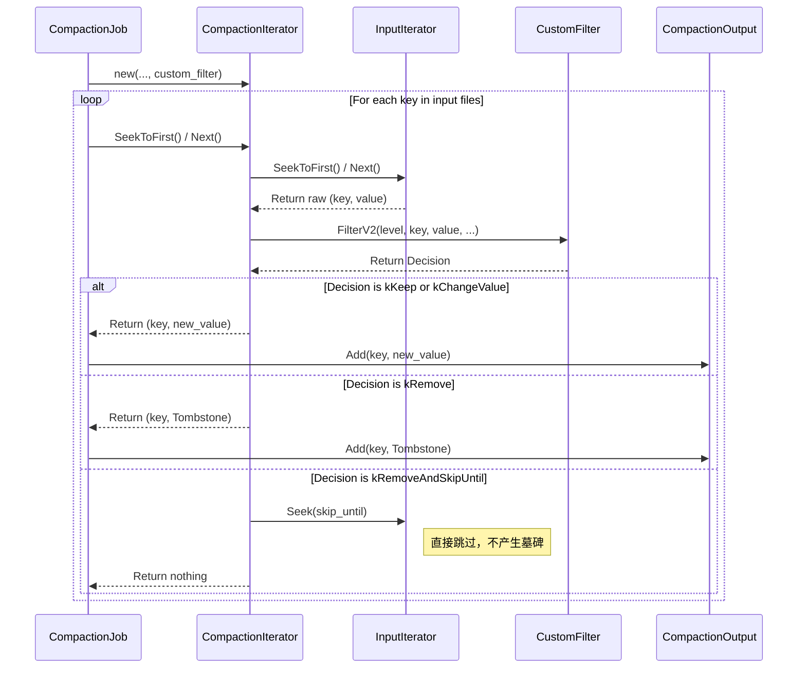
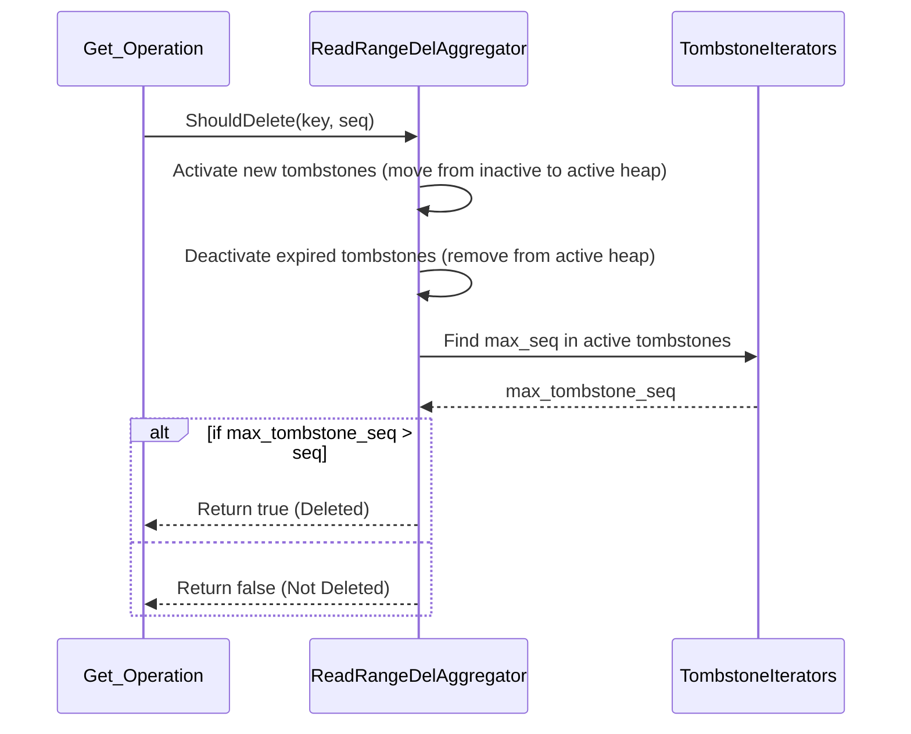
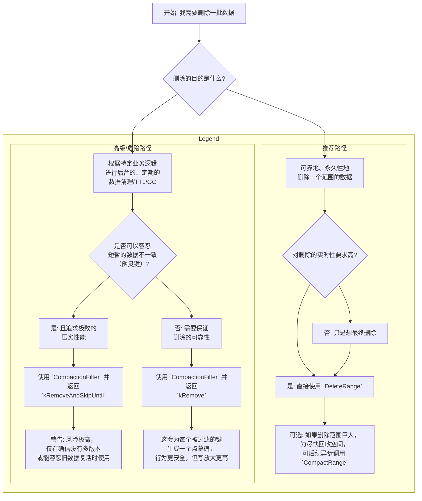

# 第 1 章：RocksDB 大规模删除的挑战

在现代数据密集型应用中，键值（Key-Value）存储扮演着至关重要的角色。作为其中的佼佼者，RocksDB 以其卓越的性能和灵活性，被广泛应用于数据库、消息队列、分布式文件系统等多种场景。然而，随着数据量的爆炸式增长和业务逻辑的日趋复杂，如何高效、彻底地删除大规模数据，成为了一个不容忽视的挑战。

## 1.1 “幽灵键”与“删除传播不彻底”：问题的核心

想象一下，在一个庞大的数据集中，您需要删除一个用户的所有相关数据，或者清理掉一批过期、无效的记录。这些操作通常涉及在一个特定的键空间内进行范围删除。在 RocksDB 这样的 LSM-Tree（Log-Structured Merge-Tree）架构的存储引擎中，删除操作并非如我们直观想象的那样“原地”抹掉数据，而是通过写入一个“墓碑”（Tombstone）标记来宣告一个键的“死亡”。

这种“懒删除”的策略，虽然极大地提高了写入性能，但也引出了一系列复杂的问题，其中最核心的两个便是“幽灵键”（Stale Keys）和“删除传播不彻底”（Incomplete Deletion Propagation）。

*   **幽灵键 (Stale Keys)**：当一个键被删除后，其“墓碑”标记和旧的数据版本可能仍然残留在存储中，直到后台的“压实”（Compaction）过程将其彻底清理。如果在压实完成前进行读操作，这些已经被删除但尚未被物理清除的键，就像“幽灵”一样，可能会意外地“复活”，导致数据不一致。特别是当旧的数据版本分布在 LSM-Tree 的不同层级时，上层的“墓碑”可能无法完全覆盖下层的旧数据，从而导致幽灵键的出现。

*   **删除传播不彻底 (Incomplete Deletion Propagation)**：当删除操作（无论是点删除还是范围删除）的“效力”未能完全传递到 LSM-Tree 的最底层时，就会发生删除传播不彻底的问题。这意味着，即使我们已经发出了删除指令，并且上层的数据已经被标记为删除，但下层的旧数据副本依然存在。这不仅占用了宝贵的存储空间，更糟糕的是，在某些特定的压实策略或故障恢复场景下，这些未被彻底删除的数据有可能再次“浮出水面”，造成数据污染。

这两个问题，如同悬在 RocksDB 大规模数据删除头上的“达摩克利斯之”剑，是每一个希望精通 RocksDB 的开发者都必须深入理解和掌握的。

## 1.2 `DeleteRange` 与 `CompactionFilter`：两大核心机制

为了应对大规模数据删除的挑战，RocksDB 提供了两大核心机制：`DeleteRange` API 和 `CompactionFilter`。

*   **`DeleteRange`**：这是 RocksDB 官方推荐的、用于范围删除的“现代”方法。它通过在存储中创建一个“范围墓碑”（Range Tombstone），来高效地标记一个连续键区间的删除。相比于逐个扫描并删除键的传统方法，`DeleteRange` 具有更高的写入性能和原子性保证。它的设计目标，就是在保证性能的同时，从根本上解决“幽灵键”问题。

*   **`CompactionFilter`**：这是一种更为灵活，也更为复杂的机制。它允许开发者在后台的压实过程中，通过自定义的逻辑来决定一个键值对的“去留”。开发者可以实现一个 `CompactionFilter`，在压实时动态地检查并过滤掉那些满足特定条件（例如，时间戳过期、属于某个被删除的集合）的键。这种机制为实现复杂的垃圾回收和数据清理逻辑提供了强大的能力。

然而，正是这两大机制的并存，以及它们与 RocksDB 复杂的 LSM-Tree 架构和压实策略的相互作用，使得大规模删除问题变得愈发微妙和复杂。

*   `DeleteRange` 和 `CompactionFilter` 能否同时使用？
*   `CompactionFilter` 在何种情况下会导致删除不彻底？
*   范围墓碑（Range Tombstone）在 SST 文件边界和合并过程中的行为是怎样的？
*   我们何时需要强制执行一次彻底的“底部压实”（Bottommost Compaction）来确保数据被“扫干净”？

要回答这些问题，我们需要像侦探一样，深入 RocksDB 的内部，探寻其设计的精髓与权衡，并从源代码的字里行间，找到问题的答案。

在接下来的章节中，我们将对 `DeleteRange` 和 `CompactionFilter` 进行深入的源码级剖析，并通过 UML 时序图，直观地展示它们的工作流程。我们将重点探讨它们之间的交互、各自的优缺点，以及如何正确地使用它们，来最终驯服 RocksDB 中大规模数据删除这头“猛兽”。

# 第 2 章：`DeleteRange` 工作机制深度剖析

`DeleteRange` 是 RocksDB 为解决大规模范围删除问题而提供的原生、高效的解决方案。理解其内部工作机制，是正确使用该功能、避免潜在问题的关键。本章将深入 `DeleteRange` 的 API、核心概念、读写路径，并结合源码进行分析。

## 2.1 `DeleteRange` API 与范围墓碑（Range Tombstone）

`DeleteRange` 的 API 非常直观。用户只需提供一个起始键（`begin_key`）和一个结束键（`end_key`），即可删除这个左闭右开区间 `[begin_key, end_key)` 内的所有键。

```cpp
// C++ API
Status DB::DeleteRange(const WriteOptions& options,
                       ColumnFamilyHandle* column_family,
                       const Slice& begin_key, const Slice& end_key);
```

这个操作的核心，在于它并不会去遍历并删除范围内的每一个键，而是创造一个被称为 **“范围墓碑”（Range Tombstone）** 的特殊标记。

**范围墓碑**可以被看作是一个元数据记录，它本身作为一个独立的键值对存在，其键包含了删除范围的起始键，而其值则包含了删除范围的结束键。这个范围墓碑一旦被写入，就宣告了其所覆盖的键区间内的所有键（无论是在写入墓碑之前还是之后写入的，只要它们的序列号小于墓碑的序列号）都处于“被删除”状态。

这种设计的优势是巨大的：
1.  **高效写入**：将一个可能包含数百万个键的范围删除操作，转化为一次单一的元数据写入。这极大地降低了写放大，并显著提升了删除操作的性能。
2.  **原子性**：`DeleteRange` 操作是原子性的。它被作为一个单一的操作写入 `WriteBatch` 和 WAL（Write-Ahead Log）中，保证了其不可分割性，避免了部分删除导致的数据不一致。

从源码层面看，`DB::DeleteRange` 的实现（位于 `db/db_impl_write.cc`）也证实了这一点。它内部会构造一个 `WriteBatch`，并调用 `WriteBatch::DeleteRange` 方法，将这个范围删除操作作为一个原子单位添加到批次中。

```cpp
// db/db_impl_write.cc
Status DB::DeleteRange(const WriteOptions& opt,
                       ColumnFamilyHandle* column_family,
                       const Slice& begin_key, const Slice& end_key) {
  WriteBatch batch(...);
  Status s = batch.DeleteRange(column_family, begin_key, end_key);
  if (!s.ok()) {
    return s;
  }
  return Write(opt, &batch);
}
```

## 2.2 `DeleteRange` 的写路径 (Write Path)

`DeleteRange` 的写路径遵循 RocksDB 标准的写流程，但针对范围墓碑做了特殊处理。

1.  **写入 WAL**：`DeleteRange` 操作首先会被序列化并作为一个独立的记录写入 WAL。这保证了即使在发生宕机的情况下，这个删除操作也能在重启恢复时被重放，确保数据的持久性和一致性。
2.  **写入 MemTable**：与普通键值对不同，范围墓碑并不会被写入存储用户数据的常规 MemTable 中。相反，RocksDB 为其维护了一个 **专属的 MemTable**，专门用于存放范围墓碑。这个 MemTable 通常采用 `SkipList` 数据结构。
3.  **分离存储**：将范围墓碑与普通数据分离存储，是 RocksDB 的一个关键设计。这主要是因为，如果将范围墓碑与普通数据混合存放，会严重破坏数据块（Data Block）中键的有序性，使得二分查找等高效检索算法失效。
4.  **Flush 到 SST 文件**：当 MemTable 写满并被 Flush 到磁盘时，存储范围墓碑的专用 MemTable 也会和其对应的数据 MemTable 一起被处理。最终，在一个新生成的 SST 文件中，范围墓碑被存储在一个特殊的 **“Range Tombstone Block”** 元数据块中，而普通数据则存储在常规的数据块（Data Block）中。

下面的 UML 时序图清晰地展示了 `DeleteRange` 的写路径：

```mermaid
sequenceDiagram
    participant Client
    participant DBImpl
    participant WriteBatch
    participant WAL
    participant RangeTombstoneMemTable
    participant DataMemTable
    participant SSTFile

    Client->>DBImpl: DeleteRange(start, end)
    DBImpl->>WriteBatch: new WriteBatch()
    WriteBatch->>WriteBatch: DeleteRange(start, end)
    DBImpl->>DBImpl: Write(batch)
    DBImpl->>WAL: Append(RangeTombstone)
    DBImpl->>RangeTombstoneMemTable: Add(RangeTombstone)
    Note right of RangeTombstoneMemTable: 数据和范围墓碑<br>在内存中分离存储
    ... later ...
    DBImpl->>SSTFile: Flush
    Note right of SSTFile: Range Tombstones are written<br>to a separate metadata block
```
这个设计确保了 `DeleteRange` 操作既高效又可靠，同时为后续的读操作优化奠定了基础。在下一节，我们将探讨 `DeleteRange` 更加复杂的读路径。

## 2.3 `DeleteRange` 的读路径 (Read Path)

`DeleteRange` 的读路径比写路径要复杂得多，因为它需要在读取数据时，动态地判断一个键是否已经被范围墓碑所覆盖。为了优化读取性能，其实现也经历了一次重要的迭代。

### 2.3.1 V1 版本：全局“天际线”聚合

在早期的实现中，当创建一个迭代器或执行一个点查找（Point Lookup）时，RocksDB 会收集所有可能与查询相关的 SST 文件和 MemTable 中的范围墓碑。然后，它会构建一个全局的、聚合后的“天际线”（Skyline）。

这个天际线的构建过程，类似于计算几何中的“天际线问题”：
*   **X 轴**：键空间（Key Space）
*   **Y 轴**：序列号（Sequence Number）

每个范围墓碑可以看作是一个矩形，其宽度是键的范围，高度是其序列号。天际线算法的目标，就是计算出在任何一个键点上，最高的序列号是多少。这样，对于任何一个读到的键，我们只需在天际线上进行一次查询，就能判断它是否被某个（或某些）范围墓碑所覆盖（即，它的序列号是否低于天际线）。

**存在的问题：**
*   **构建开销大**：在每次迭代器创建时，都需要收集所有相关的范围墓碑并构建天际线，这个过程涉及到 `O(T*log(T))` 的计算（T 是墓碑数量），开销非常大。
*   **点查性能差**：对于点查找，V1 版本的实现更为暴力，它会收集所有相关的范围墓碑，然后进行线性扫描来判断键是否被覆盖，性能很差。

### 2.3.2 V2 版本：本地“碎片化”与缓存

为了解决 V1 版本在读取性能上的瓶颈，RocksDB 在后续版本中引入了全新的 V2 设计。其核心思想是 **“化整为零，空间换时间”**。

它不再构建全局的天际线，而是在每个 SST 文件被打开时，对其内部的“Range Tombstone Block”进行一次预处理，生成一个 **“碎片化”（Fragmented）** 的、**有序且无重叠** 的范围墓碑列表。

*   **碎片化（Fragmentation）**：将SST文件内所有重叠的范围墓碑，切割成一系列互不重叠的小片段。
*   **有序性**：这些碎片化的墓碑片段，严格按照起始键（start key）排序。

经过这样处理后，每个 SST 文件的范围墓碑列表就变成了一个可以进行 **二分查找（Binary Search）** 的有序结构。

当进行读操作时：
*   **点查找 (Point Lookup)**：对于一个给定的键，RocksDB 可以在每个SST文件的缓存中，通过一次二分查找（`O(logT)`），快速定位可能覆盖该键的墓碑片段。一旦在某个层级找到了一个有效的范围墓碑，就可以（在大多数情况下）提前终止向更低层级的搜索，因为我们知道更低层级的任何版本都会被这个墓碑覆盖。这极大地提升了点查性能。
*   **范围扫描 (Range Scan)**：在创建迭代器时，RocksDB 会为每个SST文件的碎片化墓碑列表创建一个内部迭代器。在外部迭代器进行扫描时，这些内部的墓碑迭代器也会同步移动。这样，判断一个键是否被删除，就从构建全局天际线，变成了在多个有序的墓碑迭代器上进行归并比较，有效地将构建开销分摊到了整个迭代过程中。

这个 V2 设计，通过在 SST 文件加载时进行一次性的预处理和缓存，成功地将读取时的大部分计算开销转移，使得点查找和短范围扫描的性能得到了数量级的提升。

下面的 UML 时序图展示了 V2 版本 `DeleteRange` 的点查找读路径：

```mermaid
sequenceDiagram
    participant Client
    participant DBImpl
    participant Version
    participant MemTables
    participant SSTFileReaders
    participant RangeDelAggregator

    Client->>DBImpl: Get(key)
    DBImpl->>Version: Get
    Version->>MemTables: Get(key)
    MemTables-->>Version: Found / NotFound
    loop For each level in LSM-Tree
        Version->>SSTFileReaders: Get(key)
        SSTFileReaders->>RangeDelAggregator: AddTombstones(SST's fragmented tombstones)
        Note right of SSTFileReaders: Binary search in cached<br>fragmented tombstones
        SSTFileReaders-->>Version: Found / NotFound / Covered by Tombstone
        alt Key found
            Version->>RangeDelAggregator: IsKeyDeleted(key, seq)
            RangeDelAggregator-->>Version: Yes / No
            alt Not Deleted
                Version-->>DBImpl: Return value
                DBImpl-->>Client: Return value
                break
            end
        end
    end
    Version-->>DBImpl: NotFound
    DBImpl-->>Client: NotFound
```

通过这次迭代，`DeleteRange` 不仅在写路径上保持了高效，其读路径的性能也达到了与传统的“扫描-删除”模式相媲美的水平，使其成为一个在性能和功能上都非常完善的范围删除方案。

# 第 3 章：`CompactionFilter`：在压实中实现定制化逻辑

与 `DeleteRange` 这种目标明确的“外科手术式”删除不同，`CompactionFilter` 提供了一种更为灵活、也更为强大的机制，允许开发者在后台压实（Compaction）的过程中，注入自定义的逻辑，来对键值对进行修改、过滤或删除。

## 3.1 `CompactionFilter` API 概览

要使用这一功能，开发者需要继承 `rocksdb/compaction_filter.h` 中定义的 `CompactionFilter` 或 `CompactionFilterFactory` 接口。

*   **`CompactionFilter`**：这是一个相对简单的接口，开发者只需实现其核心的过滤方法。但需要注意的是，如果 `Options::compaction_filter` 被设置为一个单例的 `CompactionFilter` 对象，那么在多线程压实的环境下，这个对象的所有方法都必须是线程安全的。

*   **`CompactionFilterFactory`**：这是官方**推荐**的使用方式。工厂模式下，每次（或每种）压实任务启动时，都会通过工厂创建一个新的 `CompactionFilter` 实例。这保证了每个实例只会被一个线程访问，从而避免了线程安全问题。

```cpp
// include/rocksdb/options.h
struct Options {
  // ...
  // 不推荐：需要自行保证线程安全
  const CompactionFilter* compaction_filter = nullptr;

  // 推荐：由 RocksDB 保证每个 filter 实例的单线程访问
  std::shared_ptr<CompactionFilterFactory> compaction_filter_factory = nullptr;
  // ...
};
```

### 3.1.1 `FilterV2` 与 `Decision`

`CompactionFilter` 的核心在于 `FilterV2` 方法（或更新的、支持宽列的 `FilterV3`）。在压实过程中，输入的每个键值对（或 Merge 操作的每个操作数）都会被送入此方法进行处理。该方法返回一个 `Decision` 枚举值，来告诉 RocksDB 如何处理这个键值对。

```cpp
// include/rocksdb/compaction_filter.h
class CompactionFilter : public Customizable {
public:
  enum class Decision {
    kKeep,
    kRemove,
    kChangeValue,
    kRemoveAndSkipUntil,
    kPurge,
    // ... 其他内部使用的值
  };

  virtual Decision FilterV2(int level, const Slice& key, ValueType value_type,
                            const Slice& existing_value, std::string* new_value,
                            std::string* skip_until) const;
};
```

`Decision` 的几个关键值及其含义如下：

*   `kKeep`：保留该键值对，不做任何改动。
*   `kRemove`：移除该键值对。对于普通的值，这相当于在该位置放置一个**点墓碑（Point Tombstone）**。这个墓碑会确保覆盖掉所有更低层级、更旧版本的同名键。
*   `kChangeValue`：修改该键值对的值。通过输出参数 `new_value` 返回新的值。
*   `kPurge`：类似于 `kRemove`，但它写入的是一个 `SingleDelete` 类型的墓碑。
*   `kRemoveAndSkipUntil`：**这是最需要关注的返回值**。它指示 RocksDB 不仅要移除当前键，还要一直跳过（并丢弃）所有键，直到遇到一个大于或等于 `*skip_until` 的键。**极其重要的一点是，这种“跳过”是纯粹的物理丢弃，并不会为被跳过的键留下任何墓碑**。这正是“幽灵键”问题的主要根源之一，我们将在后续章节详细讨论。

### 3.1.2 `Context`：感知压实上下文

`CompactionFilterFactory` 在创建 `CompactionFilter` 实例时，会传入一个 `Context` 对象。这个对象包含了当前压实任务的上下文信息，使得开发者可以实现更加精细化的控制。

```cpp
// include/rocksdb/compaction_filter.h
struct CompactionFilter::Context {
  bool is_full_compaction;
  bool is_manual_compaction;
  uint32_t column_family_id;
  TableFileCreationReason reason;
  // ...
};
```

例如，开发者可以根据 `is_manual_compaction` 字段来判断本次压实是否为手动触发，从而只在手动压实时执行特定的清理逻辑。

## 3.2 `CompactionFilter` 的工作流程

`CompactionFilter` 只在后台的**压实过程**中被调用，而不会在 `Flush`（将 MemTable 刷盘到 L0）过程中被触发。

其基本工作流程可以用下面的 UML 时序图来表示：



理解 `CompactionFilter` 的核心在于，它是一个**在数据被重写时**进行干预的机制。它本身不主动触发数据删除，而是“被动”地等待压实过程来执行其定义的逻辑。这种设计既带来了灵活性，也引入了与压实调度、LSM-Tree 结构相关的复杂性，这些都将在后续章节中进一步探讨。

## 3.3 关键的权衡：与快照（Snapshot）的交互

`CompactionFilter` 的一个核心设计抉择，在于它如何与 RocksDB 的快照机制进行交互。快照为用户提供了一个特定时间点的数据视图，保证了可重复读。然而，`CompactionFilter` 的存在，却可能打破这一保证。

### 3.3.1 6.0 版本之前的行为 (已废弃)

在 RocksDB 6.0 版本之前，`CompactionFilter` 提供了一个名为 `IgnoreSnapshots()` 的虚函数。
*   如果 `IgnoreSnapshots()` 返回 `false` (默认行为)，RocksDB 在压实时会检查一个键值对是否对某个现存的快照可见。如果可见，那么即使 `FilterV2()` 决定要移除该键，RocksDB 也会**忽略**这个决定，并保留该键值对，以维护快照的一致性。
*   只有当 `IgnoreSnapshots()` 返回 `true` 时，`CompactionFilter` 的决定才会被无条件执行。

然而，官方很快发现，这个 `IgnoreSnapshots() = false` 的机制存在一个难以修复的 bug，它并不能真正地保证快照的绝对一致性。因此，这个行为在 6.0 版本中被彻底废弃。

### 3.3.2 6.0 版本之后的行为 (当前行为)

从 RocksDB 6.0 版本开始，`IgnoreSnapshots()` 方法被**废弃**。`CompactionFilter` 的行为变得简单而明确：**它总是会忽略快照**。

这意味着，一旦 `CompactionFilter` 决定移除或修改一个键值对，这个操作就会被执行，**即使这个键值对仍然对某个旧的快照可见**。

**这对开发者意味着什么？**

这是一个非常重要的权衡。它意味着，如果你正在使用 `CompactionFilter`，那么你必须接受一个事实：**通过快照进行读取，可能无法看到在快照创建之后、被 `CompactionFilter` 移除的数据**。换言之，快照的可重复读保证，在 `CompactionFilter` 面前打了折扣。

在 `include/rocksdb/compaction_filter.h` 的注释中，官方也明确地指出了这一点：

> RocksDB snapshots do not guarantee to preserve the state of the DB in the presence of CompactionFilter. Data seen from a snapshot might disappear after a table file created with a `CompactionFilter` is installed. If you use snapshots, think twice about whether you want to use `CompactionFilter` and whether you are using it in a safe way.

这个设计决策，凸显了 RocksDB 在“数据清理的灵活性”与“快照的强一致性”之间，选择了前者。对于需要使用 `CompactionFilter` 的应用来说，必须在业务逻辑层面，仔细考虑这种行为变化带来的影响，尤其是在依赖快照进行备份、恢复或一致性读的场景中。

# 第 4 章：核心问题辨析：`DeleteRange` vs. `CompactionFilter`

现在，我们已经分别了解了 `DeleteRange` 和 `CompactionFilter` 的工作机制。表面上看，它们都能实现范围删除，但在内部实现和行为语义上，却存在着天壤之别。正是这些差异，直接导致了“幽灵键”和“删除不彻底”等问题的产生。本章将对两者进行正面对决，深入辨析其核心差异。

## 4.1 核心差异：墓碑（Tombstone）的生成与否

两者最本质的区别，在于**是否为被删除的键生成墓碑**。

*   **`DeleteRange`：生成范围墓碑 (Range Tombstone)**
    *   `DeleteRange` 的核心是**主动**创建一个元数据记录——范围墓碑。这个墓碑与数据一起，在 LSM-Tree 中流动。
    *   在任何读取或压实操作中，这个范围墓碑都作为一个**强有力**的信号存在。它明确地宣告：“在这个序列号之下，此范围内的所有键都应被视为已删除”。
    *   这个墓碑的存在，保证了删除操作的效力可以**穿透**整个 LSM-Tree，直到最底层。

*   **`CompactionFilter`：默认不生成或仅生成点墓碑 (Point Tombstone)**
    *   `CompactionFilter` 是一个**被动**的机制。它只在压实过程中，对**当前参与压实**的键值对进行判断。
    *   当返回 `kRemove` 时，它会为**当前这一个键**生成一个**点墓碑**。
    *   当返回 `kRemoveAndSkipUntil` 时，它**不会生成任何墓碑**，只是简单地将范围内的键值对从压实的输出中丢弃。

## 4.2 “幽灵键”的诞生：`CompactionFilter` 的陷阱

`CompactionFilter` 的 `kRemoveAndSkipUntil` 机制，虽然在某些场景下可以避免生成大量墓碑，提升压实性能，但它也是“幽灵键”和“删除不彻底”问题的直接诱因。

让我们通过一个具体的场景来理解这个问题：

假设我们的 LSM-Tree 有两层（L0 和 L1），并且我们想要删除 `[key10, key20)` 这个范围的数据。

1.  **初始状态**：
    *   L0 层有一个 SST 文件，包含了 `key15` 的一个较新版本（`key15@seq=100`）。
    *   L1 层有一个 SST 文件，包含了 `key15` 的一个较旧版本（`key15@seq=20`）。

2.  **触发 L0->L1 的压实**：
    *   我们的 `CompactionFilter` 被触发，当它遇到 `key15@seq=100` 时，它识别出 `key15` 属于待删除范围 `[key10, key20)`。
    *   `FilterV2()` 方法返回 `kRemoveAndSkipUntil`，并设置 `skip_until` 为 `key20`。
    *   压实进程会丢弃 `key15@seq=100`，并且**不会**为它生成任何墓碑。然后，它会跳过输入流，直到遇到 `key20`。

3.  **问题出现**：
    *   由于这次压实只涉及 L0 的文件，L1 中包含 `key15@seq=20` 的文件并没有参与进来。
    *   因为 `CompactionFilter` 没有在 L0 的输出中为 `key15` 留下任何墓碑，当压实完成后，L1 中的 `key15@seq=20` 就“暴露”了出来。
    *   此时，如果我们去读取 `key15`，我们就会读到这个本该被删除的旧版本。一个“幽灵键”就此诞生。

这个例子清晰地展示了“删除传播不彻底”是如何发生的：`CompactionFilter` 的删除决定，只对**当前参与压实**的文件有效。如果一个键的旧版本存在于未参与本次压实的、更低的层级中，那么这个删除操作就无法传播下去。

## 4.3 `DeleteRange` 如何避免“幽灵键”

现在，我们来看看 `DeleteRange` 如何解决这个问题。

1.  **写入操作**：我们调用 `db->DeleteRange("key10", "key20")`。
    *   这个操作会生成一个范围墓碑，例如 `RangeTombstone([key10, key20) @seq=101)`。
    *   这个墓碑被写入 MemTable，并最终 Flush 到 L0 的某个 SST 文件中。

2.  **读取操作**：当我们读取 `key15` 时：
    *   RocksDB 的读路径会首先在 L0 找到这个范围墓碑 `RangeTombstone([key10, key20) @seq=101)`。
    *   然后，当它在 L1 看到 `key15@seq=20` 时，它会通过 `RangeDelAggregator` 进行判断。
    *   由于 `key15` 落在范围墓碑的区间内，并且其序列号 `20` **小于** 墓碑的序列号 `101`，`RangeDelAggregator` 会判定 `key15@seq=20` 已被删除。
    *   因此，`key15` 不会被返回给用户。

3.  **压实操作**：当包含 `key15@seq=20` 的 L1 文件与包含范围墓碑的 L0 文件进行压实时：
    *   压实逻辑同样会认为 `key15@seq=20` 被范围墓碑覆盖，因此会直接丢弃 `key15@seq=20`，而不会将其写入到新的 SST 文件中。

通过这种方式，范围墓碑就像一个持久的、可传递的“删除指令”，确保了无论数据分布在 LSM-Tree 的哪个角落，删除的意图都能被正确地执行。

## 4.4 性能与适用场景的权衡

| 特性 | `DeleteRange` | `CompactionFilter` |
| --- | --- | --- |
| **删除语义** | **强语义**：保证删除，通过范围墓碑确保删除操作的传播。 | **弱语义**：只对参与压实的数据有效，可能导致删除不彻底。 |
| **墓碑生成** | **是**：生成范围墓碑，会占用少量空间，并在压实中聚合。 | **否 (kRemoveAndSkipUntil)** 或 **点墓碑 (kRemove)**。 |
| **触发方式** | **主动**：API 调用立即生效（逻辑上）。 | **被动**：依赖后台压实调度，删除有延迟。 |
| **适用场景** | 需要**保证**数据被彻底、可靠删除的场景。例如，用户数据删除、GDPR 合规性要求。 | 实现复杂的、与业务逻辑耦合的**后台垃圾回收**。例如，基于 TTL 的数据过期、清理不再有效的引用等。 |
| **潜在问题** | 范围墓碑会给读路径和压实带来一定的性能开销（尽管 V2 已极大优化）。 | **幽灵键** 和 **删除不彻底**。 |

**结论**：当你的需求是**可靠地删除一个范围的数据**时，`DeleteRange` 是唯一正确的选择。`CompactionFilter`，尤其是其 `kRemoveAndSkipUntil` 模式，应该被视为一种用于**后台数据清理**或**垃圾回收**的工具，而不是一个通用的范围删除机制。使用它时，必须清楚地认识到其“非严格”的删除语义，并确保业务逻辑能够容忍可能出现的“幽灵键”。

# 第 5 章：深入 `RangeTombstone` 内部机制

为了真正理解 `DeleteRange` 如何解决“幽灵键”问题，我们必须深入其核心——`RangeTombstone` 的内部实现。本章将剖析其数据结构、存储格式以及为优化读取性能而设计的核心算法。

## 5.1 `RangeTombstone` 数据结构

`RangeTombstone` 的核心定义位于 `db/dbformat.h` 文件中。它是一个相当简洁的结构体，主要包含了三个核心信息：

```cpp
// db/dbformat.h
struct RangeTombstone {
  Slice start_key_;
  Slice end_key_;
  SequenceNumber seq_;
  // ... 其他与时间戳相关的字段和辅助函数
};
```

*   `start_key_`：范围删除的起始用户键（包含）。
*   `end_key_`：范围删除的结束用户键（不包含）。
*   `seq_`：该范围删除操作的序列号。这个序列号至关重要，它决定了此墓碑能“覆盖”哪些版本的键。只有序列号**小于** `seq_` 的键才会被该墓碑删除。

当一个 `RangeTombstone` 需要被持久化时，它会被序列化成一个标准的 `InternalKey`。具体来说：
*   `start_key_` 会成为 `InternalKey` 的 `user_key` 部分。
*   `seq_` 和 `kTypeRangeDeletion` 类型标记会被打包成8字节的 "footer"。
*   `end_key_` 则被直接作为这个 `InternalKey` 的**值（Value）**。

这种序列化方式，使得范围墓碑可以像普通键值对一样在 RocksDB 的内部系统中流转。

## 5.2 核心优化：范围墓碑的碎片化 (Fragmentation)

如第二章所述，`DeleteRange` V2 版本的性能飞跃，得益于其“碎片化”的核心思想。这个过程的实现，主要由 `db/range_tombstone_fragmenter.h` 中的 `FragmentedRangeTombstoneList` 类来完成。

当 RocksDB 打开一个 SST 文件并读取其“Range Tombstone Block”时，它会得到一个可能包含大量重叠范围的原始墓碑列表。`FragmentedRangeTombstoneList` 的构造函数会接收这个原始列表，并执行以下操作：

1.  **收集所有端点**：遍历所有原始墓碑，将它们的 `start_key` 和 `end_key` 收集起来，并进行排序、去重，形成一个所有端点的有序集合。
2.  **切割成基本区间**：使用这些有序的端点，将整个键空间切割成一系列连续的、互不重叠的“基本区间”。
3.  **构建墓碑“堆栈”**：对于每一个基本区间，找出所有**完全覆盖**了这个区间的原始墓碑。将这些墓碑的序列号（`seq_`）收集起来，从大到小排序，形成一个“堆栈”（Stack）。
4.  **生成碎片列表**：每个“基本区间”和其对应的“序列号堆栈”，就构成了一个碎片化的墓碑，即 `RangeTombstoneStack`。最终，`FragmentedRangeTombstoneList` 存储的就是这样一个由 `RangeTombstoneStack` 组成的、按 `start_key` 有序的列表。

**图示：碎片化过程**

假设我们有三个重叠的范围墓碑：
*   T1: `[a, d) @ seq=100`
*   T2: `[c, f) @ seq=200`
*   T3: `[b, e) @ seq=150`

`FragmentedRangeTombstoneList` 会将其处理成四个不重叠的碎片：
1.  **`[a, b)`**: 被 T1 覆盖。序列号堆栈: `{100}`。
2.  **`[b, c)`**: 被 T1, T3 覆盖。序列号堆栈: `{150, 100}`。
3.  **`[c, d)`**: 被 T1, T2, T3 覆盖。序列号堆栈: `{200, 150, 100}`。
4.  **`[d, e)`**: 被 T2, T3 覆盖。序列号堆栈: `{200, 150}`。
5.  **`[e, f)`**: 被 T2 覆盖。序列号堆栈: `{200}`。

```mermaid
gantt
    title Range Tombstone Fragmentation
    dateFormat X
    axisFormat %s

    section Original Tombstones
    T1: a, 100, 3d
    T2: c, 200, 3d
    T3: b, 150, 3d

    section Fragmented Stacks
    [a,b): 0, 1d
    [b,c): 1, 1d
    [c,d): 2, 1d
    [d,e): 3, 1d
    [e,f): 4, 1d

```


*(注：上图仅为示意，Gantt 图无法完全表达堆栈概念，但可展示区间的切割)*

## 5.3 缓存与迭代

经过碎片化处理后，这个 `FragmentedRangeTombstoneList` 会被缓存起来（通过 `FragmentedRangeTombstoneListCache`），与它所属的 SST 文件相关联。这确保了每个 SST 文件的碎片化计算只需进行一次。

当需要对范围墓碑进行查询时，`FragmentedRangeTombstoneIterator` 就派上了用场。它内部持有一个指向缓存的 `FragmentedRangeTombstoneList` 的指针。由于列表本身是有序的，`Seek` 操作可以通过二分查找快速定位到可能覆盖目标键的 `RangeTombstoneStack`。

这个“预处理 + 缓存”的策略，是 `DeleteRange` V2 设计的精髓。它将原本需要在每次读操作时都进行的 `O(T*logT)` 复杂计算，分摊到每个 SST 文件打开时的一次性计算中，从而极大地提升了常规读取操作的性能。
# 第 6 章：`RangeDelAggregator`：跨层级的墓碑聚合器

我们已经知道，在 V2 设计中，每个 SST 文件和 MemTable 都会独立地维护一个碎片化的、有序的范围墓碑列表。然而，在进行读操作或压实操作时，我们需要一个能够**跨越**所有 LSM-Tree 层级、所有 SST 文件和 MemTable 的统一视图，来最终判断一个键是否被删除。这个关键的角色，就由 `RangeDelAggregator` 来扮演。

## 6.1 `RangeDelAggregator` 的职责与分类

`RangeDelAggregator` 的核心职责是**聚合（Aggregate）** 来自不同来源的范围墓碑，并提供一个统一的 `ShouldDelete()` 接口，来回答“这个特定版本的键是否应该被删除？”的问题。

它的定义位于 `db/range_del_aggregator.h` 中，并主要有两个实现：

*   **`ReadRangeDelAggregator`**：用于**读路径**（如 `Get()` 和 `NewIterator()`）。它需要聚合所有层级（从 MemTable 到 Lmax）的范围墓碑，并根据指定的读取序列号（`read_seqno`）来判断键的可见性。

*   **`CompactionRangeDelAggregator`**：用于**压实路径**。它的逻辑更为复杂，因为它不仅要聚合参与压实的输入文件中的范围墓碑，还需要考虑数据库中存在的**快照（Snapshots）**。为了保证快照的（部分）一致性，它需要保留那些对快照仍然可见的墓碑。

## 6.2 “天际线”算法的再现：聚合与查询

`RangeDelAggregator` 内部实现了一个高效的“天际线”查询算法。虽然 V2 设计避免了在每个 SST 文件内部构建全局天际线，但 `RangeDelAggregator` 在**聚合来自不同层级**的墓碑时，实际上动态地构建了一个逻辑上的天际线。

其工作流程可以概括如下：

1.  **收集迭代器**：当 `RangeDelAggregator` 被创建时（例如，在一次 `Get` 操作的开始），它会收集所有相关层级的 `FragmentedRangeTombstoneIterator`，并将它们添加到一个内部列表中。

2.  **动态维护“活跃”堆**：`RangeDelAggregator` 内部使用两个堆（Heap）来动态管理这些迭代器：
    *   **`inactive_iters_`**：一个最小堆，按照墓碑的 `start_key` 排序。存储所有**尚未开始**的范围墓碑迭代器。
    *   **`active_iters_`**：一个最小堆，按照墓碑的 `end_key` 排序。存储所有**当前活跃**（即查询点已经进入其范围）的范围墓碑迭代器。

3.  **查询 `ShouldDelete()`**：当需要判断一个键 `key@seq` 是否被删除时：
    a. **激活**：首先，`RangeDelAggregator` 会检查 `inactive_iters_` 堆顶。所有 `start_key` 小于等于 `key` 的墓碑，都会被移动到 `active_iters_` 中。
    b. **清理**：然后，它会检查 `active_iters_` 堆顶。所有 `end_key` 小于等于 `key` 的墓碑，都意味着已经失效，会被移除。
    c. **查询**：完成上述两步后，`active_iters_` 中剩下的，就是所有**当前覆盖** `key` 的范围墓碑。`RangeDelAggregator` 只需遍历这个（通常很小的）集合，找到其中序列号**大于** `seq` 的、最高的那个序列号。如果找到了这样的墓碑，那么 `key@seq` 就被判定为已删除。

这个基于双堆的动态天际线算法，避免了对所有墓碑进行全局排序和聚合，而是将计算分摊到每一次 `ShouldDelete()` 查询中，实现了高效的动态查询。

下面的 UML 时序图展示了 `ReadRangeDelAggregator` 在 `Get()` 操作中的工作流程：



通过 `RangeTombstoneFragmenter` 的预处理和 `RangeDelAggregator` 的高效聚合，RocksDB 的 `DeleteRange` V2 设计，成功地在保证强删除语义的前提下，将读写性能都优化到了一个非常高的水平，优雅地解决了大规模范围删除的核心痛点。
# 第 7 章：点与范围的交锋：Point Tombstone 与 Range Tombstone 的交互

在 RocksDB 中，我们有两种类型的墓碑：由 `Delete` 操作产生的**点墓碑（Point Tombstone）**，和由 `DeleteRange` 操作产生的**范围墓碑（Range Tombstone）**。当这两种墓碑同时存在并作用于同一个键时，理解它们之间的交互规则，对于准确预测系统行为至关重要。

## 7.1 黄金法则：序列号（Sequence Number）为王

在 RocksDB 中，所有版本的冲突解决都遵循一个简单而普适的黄金法则：**拥有更高序列号（Sequence Number）的操作，会覆盖掉拥有更低序列号的操作**。

这个法则对所有操作类型都适用，无论是 `Put`、`Delete`、`Merge` 还是 `DeleteRange`。当判断一个键的最终状态时，RocksDB 会从新到旧（即从大到小）遍历所有与该键相关的序列号，它遇到的第一个操作，就决定了这个键的最终命运。

## 7.2 场景分析：点与范围的覆盖关系

基于“序列号为王”的法则，我们可以分析点墓碑和范围墓碑交互的几种典型场景。假设我们关注的键是 `key`。

### 场景一：`Delete` 在前，`DeleteRange` 在后

1.  `Delete("key")` @ `seq=100`
2.  `DeleteRange("a", "z")` @ `seq=200`

当读取 `key` 时，RocksDB 会看到两个相关的墓碑。由于 `DeleteRange` 的序列号 `200` **高于** `Delete` 的序列号 `100`，`DeleteRange` 胜出。`key` 被视为由 `DeleteRange` 删除。

### 场景二：`DeleteRange` 在前，`Delete` 在后

1.  `DeleteRange("a", "z")` @ `seq=100`
2.  `Delete("key")` @ `seq=200`

在这种情况下，`Delete` 操作的序列号 `200` **高于** `DeleteRange` 的 `100`。因此，`Delete` 操作胜出。`key` 被视为由这个点墓碑删除。虽然最终结果都是“被删除”，但归因于哪个操作是很重要的，这会影响到后续的压实行为和元数据统计。

### 场景三：`DeleteRange` 在前，`Put` 在后（“删除即视为存在”的 Corner Case）

这是一个最能体现“删除即视为存在”这一概念的场景，也是最容易产生误解的地方。

1.  `Put("key", "value_v1")` @ `seq=90`
2.  `DeleteRange("a", "z")` @ `seq=100`
3.  `Put("key", "value_v2")` @ `seq=200`

**读取 `key` 时会发生什么？**

*   RocksDB 会发现有三个与 `key` 相关的操作。
*   它会首先看到序列号最高的 `Put("key", "value_v2")` @ `seq=200`。
*   根据“序列号为王”的法则，这个 `Put` 操作胜出。
*   因此，读取 `key` 的结果将是 `value_v2`。

这个结果可能会让一些人感到意外：“我不是已经用 `DeleteRange` 删除了整个 `[a, z)` 范围吗？为什么 `key` 又‘复活’了？”

**核心解释**：
`DeleteRange` 产生的范围墓碑，并不是一个“黑洞”，可以吞噬掉所有后续写入。它和其他操作一样，也只是 LSM-Tree 中的一个带序列号的记录。它的语义是“**删除所有序列号小于我的、落在该范围内的键**”。

当一个序列号**更高**的 `Put` 操作出现时，这个新的 `Put` 自然会覆盖掉那个范围墓碑对该键的影响。这就是“**删除即视为存在**”的真正含义：一个删除标记（无论是点还是范围），在版本冲突的裁决中，与其他操作（如 `Put`）是**平等**的，它们的优先级仅由序列号决定。一个删除操作并不会阻止一个更新的、带有更高序列号的写入操作“复活”这个键。

理解这一点，对于在复杂的业务场景中正确使用 `Delete` 和 `DeleteRange` 至关重要。它提醒我们，删除操作并非一劳永逸，我们必须始终关注操作的时序（即序列号的顺序），才能准确预测数据的最终状态。

# 第 8 章：SST 边界对齐与合并

范围删除的效率和正确性，不仅取决于墓碑的实现，还与 SST 文件的物理布局，特别是其边界（`smallest_key` 和 `largest_key`）息息相关。本章将探讨 SST 文件边界如何影响范围删除，以及 RocksDB 如何在压实过程中处理跨越多个文件的范围墓碑。

## 8.1 `DeleteFilesInRange()`：快速但粗糙的物理删除

在讨论压实之前，有必要了解一个与 SST 文件边界紧密相关的 API：`DeleteFilesInRange()`。

这个 API 提供了一种快速回收空间的方法。它的逻辑非常简单直接：遍历指定层级的所有 SST 文件，如果一个文件的键范围 [`smallest_key`, `largest_key`] **完全包含**在用户指定的删除范围 `[begin, end)` 内，那么这个文件就会被**直接物理删除**。

**优点**：
*   **速度极快**：它不涉及重写数据，只是简单的文件删除操作，因此能迅速回收大量空间。
*   **写放大为零**：没有数据的读写，因此不会增加写放大。

**缺点与风险**：
*   **不精确**：它只能删除那些**完全落入**删除范围的文件。如果一个 SST 文件的范围只有部分与删除范围重叠，那么这个文件就不会被删除。这意味着，`DeleteFilesInRange()` **不能保证**删除范围内的所有数据都被清理掉。
*   **破坏快照**：这是一个非常危险的操作，因为它会**无视快照**。如果被删除的文件中，有数据对某个现存的快照是可见的，那么这个快照的一致性将被破坏。从这个快照中读取数据，可能会导致意想不到的结果甚至崩溃。

因此，`DeleteFilesInRange()` 通常被用作一种辅助的、用于快速回收大部分空间的优化手段，而不是一个可靠的、独立的删除工具。它常常与 `CompactRange()` 结合使用：先用 `DeleteFilesInRange()` 删除大部分完全被覆盖的文件，再用 `CompactRange()` 来清理那些部分重叠的文件中的剩余数据。

## 8.2 压实过程中的范围墓碑合并

`DeleteRange` 的真正威力，体现在它与压实过程的无缝集成中。当多个 SST 文件被选中参与一场压实时，它们各自的范围墓碑（已经被碎片化）也需要被合并和处理。

这个过程由 `CompactionRangeDelAggregator` 负责。它的工作原理与 `ReadRangeDelAggregator` 类似，都是构建一个逻辑上的“天际线”。但它的目标不同：不是为了回答某个特定键是否被删除，而是为了生成一组**新的、合并后**的范围墓碑，写入到输出的 SST 文件中。

**合并过程**：
1.  **聚合**：`CompactionRangeDelAggregator` 收集所有参与压实的输入文件中的 `FragmentedRangeTombstoneIterator`。
2.  **构建天际线**：它遍历所有输入键，并使用与读路径类似的双堆算法，动态维护一个覆盖当前键的、所有活跃的范围墓碑的“天际线”。
3.  **输出新墓碑**：在压实过程中，`CompactionJob` 会查询 `CompactionRangeDelAggregator`。对于任何被天际线完全覆盖的、来自输入文件的键值对，`CompactionJob` 会直接将其丢弃。同时，`CompactionRangeDelAggregator` 会根据聚合后的天际线，生成一组新的、最简化的范围墓碑，写入到输出文件中。

## 8.3 范围墓碑与 SST 文件边界的对齐

一个重要的细节是，范围墓碑本身也会影响压实输出文件的切分。RocksDB 会尽量保证输出的 SST 文件的键范围是连续且不重叠的。

*   **墓碑的截断**：如果一个范围墓碑 `[a, z)` 跨越了多个新生成的 SST 文件（例如，第一个文件结尾是 `m`，第二个文件开头是 `m`），那么 RocksDB 会将这个墓碑**截断**。
    *   在第一个输出文件中，会写入一个截断后的墓碑，例如 `[a, m]`。
    *   在第二个输出文件中，会写入剩下的部分，例如 `[m, z)`。
*   **边界对齐**：RocksDB 的压实逻辑会考虑范围墓碑的端点，并倾向于在这些端点上进行文件切分。这有助于减少跨文件的范围墓碑数量，从而提升后续的查询性能。`CompactionJob` 在决定下一个输出文件的边界时，会参考 `RangeDelAggregator` 提供的墓碑信息，避免产生不必要的跨文件墓碑。

通过这种在压实过程中对范围墓碑的合并、截断和对齐，RocksDB 确保了 `DeleteRange` 的删除语义能够正确地在 LSM-Tree 的层级之间传递，并且在物理存储上保持高效和整洁。
# 第 9 章：终极清理：何时需要强制底部压实？

我们已经知道，无论是点墓碑还是范围墓碑，它们都只是一个**逻辑上**的删除标记。这些墓碑和它们所覆盖的旧数据，并不会立即从磁盘上消失。它们会随着一轮又一轮的压实，逐步向 LSM-Tree 的最底层迁移。那么，这些无用的数据和墓碑，究竟在何时才能被彻底地物理删除，从而真正地释放磁盘空间呢？答案是：**在压实到最底层（Bottommost Level）时**。

## 9.1 为何只有最底层压实才能彻底删除？

LSM-Tree 的核心设计原则之一，就是保证数据的多版本共存。对于一个给定的键，它的不同版本可能分布在多个不同的层级。一个位于 `Level L` 的墓碑，只能保证覆盖掉 `Level L` 以及所有高于它的层级（`Level 0` 到 `Level L-1`）中的旧数据。但是，RocksDB 无法确定在更低的层级（`Level L+1` 到 `Lmax`）中，是否还存在这个键的更旧的版本。

因此，为了维护数据的一致性，这个墓碑必须被保留下来，并继续参与后续的压实，直到它被推向 LSM-Tree 的**最底层**。

只有当一个墓碑（无论是点还是范围）参与到一次**输出到最底层**的压实时，RocksDB 才能百分之百地确定，在这个墓碑之下，绝对不可能再有任何更旧版本的数据了。此时，这个墓碑和它所覆盖的所有旧数据，才完成了它们的历史使命，可以被安全地、彻底地从压实的输出中丢弃，从而实现物理空间的回收。

## 9.2 何时需要强制执行 `CompactRange`？

在大多数情况下，我们不需要手动干预，RocksDB 的后台自动压实机制会最终将这些无用数据清理掉。然而，在某些特定场景下，我们可能希望**立即**或**尽快**回收由大规模删除所产生的空间。

以下是一些可能需要强制执行底部压实的典型场景：

1.  **大规模数据清理后**：当你刚刚使用 `DeleteRange` 删除了一张大表或者一个用户的海量数据后，这些数据在逻辑上已经不可见了，但物理空间并未释放。如果磁盘空间紧张，或者你希望尽快降低存储成本，那么手动触发一次覆盖该范围的 `CompactRange` 是一个有效的选择。

2.  **消除范围删除带来的性能抖动**：虽然 `DeleteRange` 的 V2 版本已经极大地优化了读性能，但在一个存在大量范围墓碑的系统中，迭代器（尤其是长距离扫描）的性能仍然会受到一定影响。因为迭代器在行进过程中，需要不断地与这些范围墓碑进行比较。通过一次彻底的 `CompactRange`，将这些范围墓碑和它们覆盖的数据一起物理删除，可以完全消除这种性能影响，使读性能恢复到最佳状态。

3.  **作为 `DeleteFilesInRange` 的补充**：如前所述，`DeleteFilesInRange` 只能删除完全被包含的文件。对于那些部分重叠的文件，它无能为力。因此，一个常见的最佳实践是：
    a. 先调用 `DeleteFilesInRange()` 快速删除掉大部分“干净”的文件。
    b. 再对删除的范围调用 `CompactRange()`，来清理剩下那些“脏”文件中的残留数据。

## 9.3 如何正确执行强制压实

当你决定需要强制执行一次压实时，应该使用 `CompactRange()` API。

```cpp
// C++ API
CompactRangeOptions options;
// 强制压实到最底层，即使这会产生不合适的输出文件大小
options.bottommost_level_compaction = BottommostLevelCompaction::kForceOptimized;
// 建议设置为 true，以避免因为平凡移动（Trivial Move）而跳过压实
options.exclusive_manual_compaction = true;

db->CompactRange(options, start_key, end_key);
```

**关键选项**：

*   `bottommost_level_compaction`：这是最重要的选项。将其设置为 `BottommostLevelCompaction::kForce` 或 `BottommostLevelCompaction::kForceOptimized`，可以告诉 RocksDB：“我希望这次压实的目标是尽可能地将数据推向最底层，并且如果输出层级已经是最后一层，就彻底地清理掉墓碑和被覆盖的数据”。
*   `exclusive_manual_compaction`：设置为 `true` 可以防止其他后台压实任务干扰本次手动压实，并确保压实会发生，而不会因为满足“平凡移动”的条件而被跳过。

**总结**：强制执行底部压实，是一个用于**空间回收**和**性能优化**的“重型武器”。它会带来额外的 I/O 开销，因此不应被滥用。但在确实需要“扫干净”数据库的场景下，它又是不可或缺的、保证数据彻底删除的最终手段。
# 第 10 章：最佳实践与建议

经过前面九章的深入探讨，我们已经从原理到源码，全面剖析了 RocksDB 中与大规模删除相关的两大核心机制：`DeleteRange` 和 `CompactionFilter`。在本章中，我们将提炼出关键的结论，并为开发者提供一套切实可行的最佳实践和决策指南。

## 10.1 核心结论回顾

1.  **`DeleteRange` 是用于“删除”的，`CompactionFilter` 是用于“过滤”的**：这是两者最根本的定位差异。`DeleteRange` 提供的是强删除语义，其目标就是可靠、高效地删除一个范围的数据。而 `CompactionFilter` 提供的是一种在压实过程中进行数据清洗和整理的逻辑，其删除行为是**被动**且**非严格**的。

2.  **范围墓碑是 `DeleteRange` 可靠性的基石**：`DeleteRange` 通过生成范围墓碑，确保了删除操作的意图可以穿透 LSM-Tree 的所有层级，从而避免了“幽灵键”和“删除不彻底”的问题。

3.  **`CompactionFilter` 的 `kRemoveAndSkipUntil` 是一把双刃剑**：它在某些场景下能提供极致的压实性能（通过避免写墓碑），但其代价是可能导致旧版本数据“复活”。**绝对不能**将其作为通用的、可靠的范围删除工具。

4.  **序列号为王**：在 RocksDB 中，所有操作的冲突都由序列号裁决。一个更高序列号的 `Put` 操作，可以“复活”一个被较低序列号的 `Delete` 或 `DeleteRange` 删除的键。

5.  **空间回收依赖于最底层压实**：无论是点墓碑还是范围墓碑，它们和被其覆盖的数据，只有在被压实到 LSM-Tree 的最底层时，才能被物理删除。

## 10.2 决策指南：如何选择正确的删除策略？

面对具体业务需求，我们该如何选择？下面提供一个决策流程图，帮助你做出正确的选择。



## 10.3 实用建议

1.  **首选 `DeleteRange`**：对于所有“删除数据”的需求，都应该将 `DeleteRange` 作为你的第一选择。它是官方推荐的、为这个场景专门设计的、最安全、最高效的方案。

2.  **谨慎使用 `CompactionFilter`**：只有当你需要实现的逻辑，是**基于键值对自身的内容**（如“所有值以 'tmp_' 开头的键”、“所有超过 TTL 的键”）进行**过滤**时，才应该考虑使用 `CompactionFilter`。不要用它来模拟 `DeleteRange` 的功能。

3.  **组合使用 `DeleteFilesInRange` 和 `CompactRange`**：当你完成一次非常大的 `DeleteRange` 操作后，如果需要尽快回收磁盘空间，可以采用“两步走”策略：
    *   首先，调用 `DeleteFilesInRange()`，它可以无成本地删除掉那些键范围完全落在删除区间内的 SST 文件。
    *   然后，对同一范围调用 `CompactRange()`，并设置 `bottommost_level_compaction = kForceOptimized`，来清理那些部分重叠的文件中的剩余数据和范围墓碑本身。

4.  **监控你的墓碑**：RocksDB 的 `DB::GetProperty` 接口提供了丰富的统计信息。你应该关注与墓碑相关的统计数据，例如 `rocksdb.num-range-deletions` 和 `rocksdb.estimate-num-keys`，来了解数据库中墓碑的数量和分布，这有助于你判断是否需要进行手动的压实。

5.  **理解你的压实策略**：不同的压实策略（如 `Leveled Compaction` 和 `Universal Compaction`）对数据的迁移和清理速度有很大影响。理解你的压实策略，有助于你更好地预测范围删除后空间回收的效率。

通过遵循以上建议，并深刻理解 `DeleteRange` 和 `CompactionFilter` 背后的设计哲学，你就能在复杂的业务场景中，游刃有余地驾驭 RocksDB 的大规模数据删除功能，构建出既高效又稳健的存储系统。
