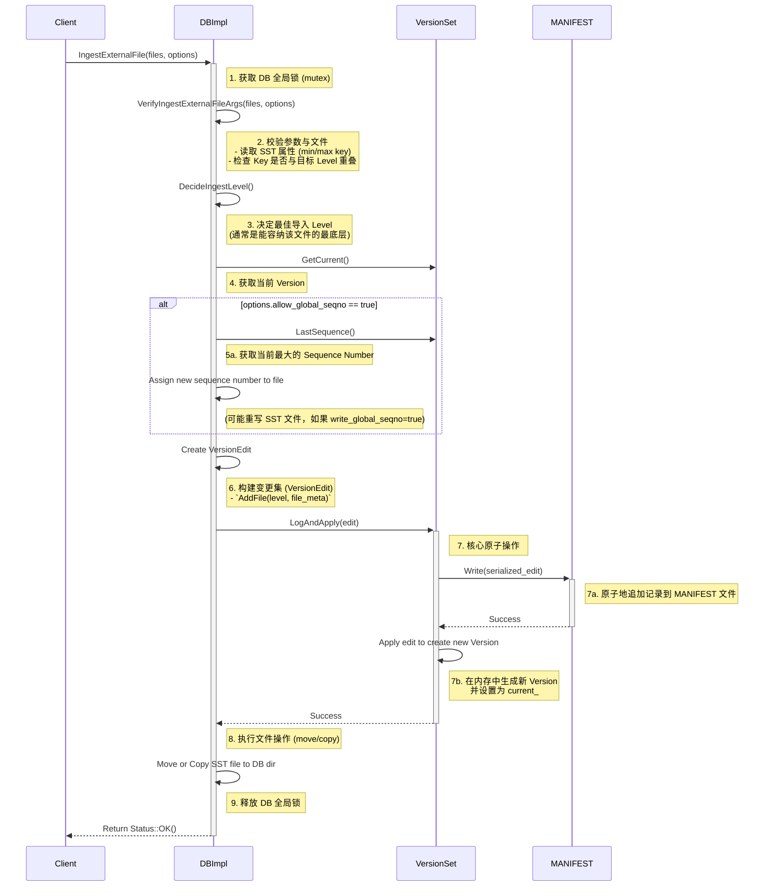

# 深入解析 RocksDB：SST 外部导入 (Bulk Load) 的一致性边界与核心机制

> 本文基于 RocksDB 源码，深入探讨 `IngestExternalFile` (Bulk Load) 功能的实现原理、一致性模型、边界条件与高级用法。旨在回答 RocksDB 用户，特别是分布式数据库开发者，在使用该功能时遇到的核心问题。

## 第一章：引言：SST 外部导入 (Bulk Load) 的价值

在构建高性能数据存储系统时，数据的写入方式对整体性能有着至关重要的影响。传统的单条写入（如 `Put` API）虽然通用，但在大规模数据批量加载场景下，会面临性能瓶颈、写放大（Write Amplification）严重以及资源竞争激烈等问题。为了解决这一痛点，RocksDB 提供了 `IngestExternalFile` API，通常被称为 “Bulk Load” 或 “SST Ingestion”。

### 1.1 什么是 Bulk Load？

Bulk Load 是一种将数据批量导入 RocksDB 的高效机制。它允许用户在 RocksDB 之外（例如，在一个离线的 MapReduce/Spark 任务中）预先构建好标准的 SST (Sorted String Table) 文件，然后通过 `IngestExternalFile` 接口，将这些 SST 文件“链接”或“移动”到 RocksDB 的 LSM-Tree 中。

这个过程绕过了常规的写入路径，包括 MemTable、WAL (Write-Ahead Log) 以及后续的 Flush 和 Compaction。

### 1.2 为什么需要它？对比 `Put` API 的优劣

为了理解 `IngestExternalFile` 的价值，我们将其与标准的 `Put` API 进行对比：

| 特性 | 标准 `Put` API | `IngestExternalFile` (Bulk Load) |
| :--- | :--- | :--- |
| **写入路径** | `Client -> WAL -> MemTable -> Flush (L0 SST) -> Compaction (L1-Ln)` | `Offline Job -> SST File -> DB Metadata (MANIFEST)` |
| **性能** | 较慢，受限于 MemTable 写入速度和 WAL 同步。 | 极快，主要是元数据操作和可选的文件移动。 |
| **写放大** | 严重。一次写入可能触发多次 Compaction，导致数据被反复读写。 | 几乎为零。数据只被写入一次（在离线阶段），导入过程不重写数据。 |
| **资源消耗** | 占用线上 DB 的 CPU、内存和 I/O，用于 Flush 和 Compaction。 | 离线准备 SST 消耗外部资源，线上导入仅短暂占用 DB 锁。 |
| **原子性** | 单 Key 原子。多 Key 需使用 `WriteBatch`。 | **单 SST 文件原子**。整个文件要么成功导入，要么失败。 |
| **适用场景** | 实时在线写入、更新。 | 初始数据加载、离线数据ETL、从备份恢复、数据库迁移。 |

简而言之，`IngestExternalFile` 通过将数据准备工作移到线下，并以一种对线上服务干扰最小的方式完成数据加载，极大地提升了批量导入的效率和性能。

### 1.3 `IngestExternalFile` 在 RocksDB 中的定位

`IngestExternalFile` 是 RocksDB 提供的一个高级功能，它并非旨在取代常规写入，而是作为一种特殊的、高性能的数据加载通道。它利用了 LSM-Tree 的核心设计哲学：**数据的不可变性 (Immutability)**。SST 文件一旦生成，其内容便不再改变。Ingestion 正是利用了这一点，将一个外部生成的、合法的 SST 文件直接纳入 LSM-Tree 的版本管理体系中，从而成为数据库状态的一部分。

理解 `IngestExternalFile` 的关键，在于理解它本质上是一个**元数据操作**，而非数据操作。接下来的章节，我们将深入其原子性基石——MANIFEST 文件。

## 第二章：核心原子性基石：MANIFEST 与 VersionEdit

要理解 `IngestExternalFile` 如何在不阻塞读写的情况下实现原子性导入，我们必须首先了解 RocksDB 是如何管理其元数据状态的。其核心在于一个名为 `MANIFEST` 的文件。

### 2.1 LSM-Tree 的元数据管理

一个 RocksDB 实例包含多个 SST 文件，分布在不同的 Level (L0, L1, ..., Ln)。此外，还有内存中的 MemTable 和日志文件 WAL。那么，RocksDB 是如何精确知晓在任何一个时间点，哪些 SST 文件是有效的、它们分别属于哪个 Level、以及每个文件的键范围 (min/max key) 是什么？

答案就存储在元数据中。这些元数据在 RocksDB 中被抽象为一个 `Version` 对象。每个 `Version` 对象都代表了数据库在某个瞬间的完整快照，精确描述了构成该快照的所有 SST 文件的集合和它们的属性。

### 2.2 MANIFEST 文件的角色：数据库的操作日志

`MANIFEST` 文件是 RocksDB 的“元数据日志”或“操作日志”。它以追加写入（Append-only）的方式，记录了对数据库状态的所有变更历史。这些变更包括：

*   添加一个新 SST 文件（Flush 或 Compaction 的结果）。
*   删除一个旧 SST 文件（Compaction 的输入）。
*   改变 Compaction 的指针。
*   **以及，导入一个外部 SST 文件。**

当 RocksDB 启动时，它会重放 `MANIFEST` 文件中的所有记录，从而在内存中重建起当前最新的 `Version` 对象，恢复数据库的元数据状态。

### 2.3 `Version`, `VersionSet` 与 `VersionEdit`

这三个概念是理解元数据管理的关键：

*   **`Version`**: 如前所述，一个不可变的（Immutable）对象，代表数据库某个时间点的状态快照。它包含了所有活跃 SST 文件的列表。
*   **`VersionSet`**: 管理所有 `Version` 的集合。它维护一个 `Version` 的双向链表，并持有当前的最新 `Version` (`current_`)。数据库的所有状态变更都由 `VersionSet` 来协调。
*   **`VersionEdit`**: 一个描述状态“增量变更”的对象。它不代表一个完整的状态，而是描述“从 Version A 到 Version B 需要做什么”。例如，一个 `VersionEdit` 可能会记录：“在 L1 层增加文件 F1，同时在 L2 层删除文件 F2 和 F3”。

### 2.4 揭示 `IngestExternalFile` 原子性的本质

`IngestExternalFile` 的原子性，正是通过向 `MANIFEST` 文件**原子地追加一条 `VersionEdit` 记录**来实现的。

整个导入过程可以简化为以下逻辑：

1.  **准备阶段**：RocksDB 对待导入的 SST 文件进行一系列检查（如键范围是否重叠等）。
2.  **构建变更集**：如果检查通过，RocksDB 会创建一个 `VersionEdit` 对象。这个对象的核心内容是：“在某一层（例如 L5）增加一个新的 SST 文件（我们正在导入的这个）”。
3.  **提交变更**：RocksDB 将这个 `VersionEdit` 对象序列化后，作为一条记录，**一次性、原子地**追加写入到 `MANIFEST` 文件的末尾。
4.  **应用变更**：一旦 `MANIFEST` 写入成功，RocksDB 就会基于当前的 `Version` 和这个 `VersionEdit`，在内存中生成一个新的 `Version` 对象，并将其设置为 `current_`。

**原子性的保证**：这个过程的原子性由文件系统的 `append` 操作保证。如果 `MANIFEST` 写入成功，导入操作就成功了，新的 `Version` 立刻对新的读请求可见。如果写入过程中进程崩溃或服务器掉电，`MANIFEST` 文件中只会留下一条不完整的、损坏的记录。RocksDB 在下次启动时，会识别并忽略这条损坏的记录，数据库状态将回退到写入前的状态。

因此，`IngestExternalFile` 的原子性并非由复杂的事务或锁机制提供，而是巧妙地利用了日志追加的原子性，这使得该操作本身非常轻量和高效。

## 第三章：`IngestExternalFile` API 详解

了解了其原子性原理后，我们来看一下如何使用这个功能。`IngestExternalFile` 的灵活性和行为在很大程度上由其参数控制。

### 3.1 `DB::IngestExternalFile()` 接口定义

在 C++ 中，其核心 API 定义在 `rocksdb/db.h` 中，大致如下：

```cpp
virtual Status IngestExternalFile(
    const std::vector<std::string>& file_path_list,
    const IngestExternalFileOptions& options) = 0;
```

*   `file_path_list`: 一个包含一个或多个 SST 文件路径的列表。虽然可以传入多个文件，但通常建议一次导入一个，除非能确保它们之间没有键重叠且目标 Level 非 0。
*   `options`: 一个 `IngestExternalFileOptions` 结构体，用于控制导入的各种行为。

### 3.2 `IngestExternalFileOptions` 的关键参数解析

这个结构体中的参数是控制导入行为的关键，理解它们至关重要。

*   **`bool move_files`**:
    *   `true` (默认): RocksDB 会尝试用 `rename` 系统调用将 SST 文件移动到数据库目录中。这是一个非常快的元数据操作。如果成功，原始文件将不复存在。
    *   `false`: RocksDB 会复制该 SST 文件。这会消耗额外的 I/O 和时间，但原始文件会保留。当原始 SST 文件还需要用于其他目的时（例如，导入到另一个集群），可以设置为 `false`。

*   **`bool snapshot_consistency`**:
    *   `true` (默认): RocksDB 会保证导入操作不会影响任何现有快照的可见性。即，在导入操作开始前创建的快照，将永远不会看到被导入的数据。这是通过在导入时检查是否有快照持有比该文件更老的视图来实现的。如果检查失败，导入会中止。
    *   `false`: 关闭此检查。在确定没有可能冲突的旧快照时，可以关闭以获取微小的性能提升，但不推荐常规使用。

*   **`bool allow_global_seqno`**:
    *   `true`: RocksDB 会为导入的 SST 文件中的所有 Key 分配一个全局唯一的、最新的序列号 (Sequence Number)。这意味着这些 Key 将被视为“最新”的数据，会覆盖掉数据库中任何既有的、相同 User Key 的旧值。
    *   `false` (默认): RocksDB 不会分配全局序列号，SST 文件中的所有 Key 的序列号将被视为 0。这意味着这些 Key 是“最古老”的数据。如果数据库中已存在相同 User Key 的值，那么导入的这个 Key 将被旧值覆盖（在读取时）。这个选项通常用于加载那些不应覆盖线上新数据的“基础”数据。

*   **`bool ingest_behind`**:
    *   这是一个非常重要的性能优化选项，我们将在后续章节详细探讨。
    *   `true`: 告诉 RocksDB，我们正在导入的数据的 Key Range 保证位于现有数据的“后方”（即所有 Key 都大于数据库中已有的最大 Key），或者虽然有重叠，但我们允许新导入的数据被“隐藏”在现有数据之后（需要 `allow_global_seqno=false`）。这可以跳过一些昂贵的检查，从而在特定场景下避免写停顿。
    *   `false` (默认): RocksDB 会执行严格的重叠检查。

*   **`bool write_global_seqno`**:
    *   `true` (默认): 当 `allow_global_seqno=true` 时，RocksDB 不仅在内存中为 Key 分配序列号，还会实际重写 SST 文件，将序列号持久化到文件中。这是一个昂贵的操作，因为它违背了 Ingestion “不重写数据”的初衷。
    *   `false`: 即使 `allow_global_seqno=true`，也禁止重写 SST 文件。RocksDB 会在内存中（`Version` 对象里）记录一个“虚拟”的序列号分配给这个文件。这避免了重写开销，是目前推荐的方式。

理解这些参数的组合使用，是精确控制数据一致性、顺序和性能的关键。在接下来的章节中，我们将基于这些参数，深入分析导入的校验机制、时序、边界条件和失败回滚等高级主题。

## 第四章：导入前置条件：校验机制与边界检查

在 RocksDB 真正执行 Ingestion 操作之前，它会进行一系列严格的校验，以确保外部 SST 文件的加入不会破坏 LSM-Tree 的内部不变量 (invariant)。这些检查是保证数据库一致性的第一道防线。这些逻辑主要集中在 `DBImpl::VerifyIngestExternalFileArgs()` 函数中。

### 4.1 边界检查：Key Range 的重叠问题

LSM-Tree 的一个核心不变量是：**从 L1 层开始，任意一层内的所有 SST 文件，其键范围 (Key Range) 互不重叠。** 这使得在查询时，对于每一层，最多只需要检查一个 SST 文件。

`IngestExternalFile` 必须遵守这个规则。因此，其校验逻辑根据目标 Level 的不同而有所区别：

#### 4.1.1 目标 Level > 0 的情况

当用户期望将 SST 文件直接导入到 L1 或更高层时（通常是为了获得最佳的读性能），RocksDB 会执行最严格的检查。它会遍历目标 Level 的所有现有 SST 文件，确保待导入文件的 `[smallest_key, largest_key]` 区间与该层任何已有文件的区间都没有重叠。

*   **源码逻辑**: 在 `DBImpl::VerifyIngestExternalFileArgs` 中，会调用 `version->OverlapWithLevel()` 来检查。它会将待导入文件的元数据（特别是 `smallestkey` 和 `largestkey`）与 `Version` 对象中对应 Level 的所有文件进行比较。
*   **失败场景**: 如果检测到任何重叠，导入操作将立即失败，并返回 `Status::InvalidArgument`，错误信息通常会指出存在键重叠。

#### 4.1.2 目标 Level = 0 的情况

L0 层是一个例外，它允许 SST 文件之间的键范围存在重叠。这是因为 L0 是 MemTable `Flush` 操作的直接产物，多个 MemTable 可能包含相同的键。因此，将外部文件导入 L0 的重叠检查要宽松得多。

然而，即便是在 L0，也存在一个重要的限制：**待导入的文件不能与正在进行的 MemTable-to-L0 的 Flush 操作产生冲突**。RocksDB 通过检查待导入文件的键范围是否与任何 MemTable 的键范围有重叠来规避此风险。如果存在重叠，导入操作可能会被推迟或失败，以优先保证 Flush 操作的正确性。

此外，向 L0 导入大量重叠的文件，虽然是允许的，但通常会很快触发 L0->L1 的 Compaction，这可能会给线上服务带来压力。因此，即便是导入 L0，也推荐用户预先处理数据，尽量减少不必要的重叠。

### 4.2 文件元数据校验

RocksDB 会打开外部 SST 文件，并读取其属性块 (Properties Block)。这一步至关重要，因为它需要获取以下信息用于后续决策：

*   **`smallest_key` / `largest_key`**: 用于上述的边界检查。
*   **Column Family 信息**: 确保 SST 文件属于正确的列族。
*   **Sequence Number 信息**: 检查文件内部是否已经包含了非零的序列号。如果 `allow_global_seqno=false`，但文件内部的 Key 已经有了全局序列号，这通常是一个错误，导入会失败。
*   **Table Options/Format**: 确认 SST 的格式与当前数据库的配置兼容。

如果文件无法打开、损坏，或者元数据不符合预期，校验阶段就会失败。

## 第五章：SST 导入全流程时序图与源码走读

现在，我们将整个 `IngestExternalFile` 的生命周期串联起来，通过一个时序图和源码逻辑的解读，来展示各个组件是如何协同工作的。

### 5.1 导入流程时序图 (Mermaid)



### 5.2 核心源码走读 (`DBImpl::IngestExternalFile`)

1.  **加锁**：整个 `IngestExternalFile` 操作的第一步和最后一步，分别是获取和释放 `DBImpl` 的主互斥锁 (`mutex_`)。这保证了在 Ingestion 期间，没有其他线程（如 Compaction、Flush）可以修改数据库的元数据状态。
2.  **校验 (`VerifyIngestExternalFileArgs`)**：如第四章所述，这是关键的防卫性检查。它会确保传入的文件和选项是合法的，不会破坏数据库的一致性。
3.  **确定 Level (`DecideIngestLevel`)**：RocksDB 会根据 LSM-Tree 的当前形状，自动选择一个最佳的 Level 进行导入。选择的策略通常是“尽可能往下推”，即选择一个能容纳该文件且不产生重叠的、编号最大的 Level。这有助于减少未来的 Compaction 工作量。
4.  **分配序列号**：如果 `allow_global_seqno` 为 `true`，RocksDB 会从 `VersionSet` 中获取当前的 `LastSequence`，并为这个文件分配一个新的、更大的序列号。这个序列号代表了文件在整个数据库中的逻辑时间。
5.  **构建 `VersionEdit`**：所有变更都被封装在一个 `VersionEdit` 对象中。核心操作是 `edit->AddFile()`，它记录了要在哪个 `level` 添加哪个 `file` 的元数据。
6.  **`LogAndApply`**：这是整个过程的“引爆点”。`VersionSet::LogAndApply()` 函数负责：
    *   将 `VersionEdit` 序列化。
    *   以原子方式将其写入 `MANIFEST` 日志。
    *   如果写入成功，则在内存中应用这个 `edit`，生成一个新的 `Version` 对象，并切换 `current_` 指针指向这个新 `Version`。
7.  **物理文件操作**：在元数据成功更新后，RocksDB 才会执行物理文件的 `move` 或 `copy` 操作，将 SST 文件正式纳入数据库目录下。
8.  **释放锁与返回**：完成所有操作后，释放锁，告知客户端操作成功。

## 第六章：一致性边界 (1)：顺序语义与 `allow_global_seqno`

现在我们来回答主问题中的一个核心点：`IngestExternalFile` 的顺序语义是什么？这完全由 `allow_global_seqno` 参数控制，它直接决定了导入数据在数据库中的“新旧”程度。

### 6.1 `allow_global_seqno = false` (默认)

*   **语义**: “我正在导入的是一批基础数据或历史数据，它们不应该覆盖任何线上已有的新数据。”
*   **实现**: 导入的 SST 文件中所有 Key 的序列号 (Sequence Number) 都被视为 0。在 RocksDB 的 MVCC 模型中，序列号为 0 是最古老的数据。
*   **行为**:
    *   如果数据库中已存在一个 User Key `K`，其序列号为 `S > 0`。
    *   此时导入一个包含 `K` 的 SST 文件，由于其序列号为 0，在读取时，`K` 的新值将被旧值（序列号为 `S` 的值）所**覆盖**。
    *   换句话说，导入的数据只有在数据库中不存在相应 User Key 时才可见。
*   **适用场景**:
    *   **冷数据回填**: 将归档的、非常旧的数据导回线上库进行分析。
    *   **数据库迁移/初始化**: 在一个空数据库中加载初始数据集。此时因为没有旧数据，所以序列号为 0 没有影响。

### 6.2 `allow_global_seqno = true`

*   **语义**: “我正在导入的是一批最新的数据，它们应该覆盖掉任何已存在的旧值。”
*   **实现**: RocksDB 会为这个 SST 文件分配一个**全局**的、**大于**当前数据库中任何已有序列号的新序列号 `S_new`。这个序列号在逻辑上赋给了文件中的所有 Key。
*   **行为**:
    *   如果数据库中已存在一个 User Key `K`，其序列号为 `S_old`。
    *   导入的 SST 文件包含 `K`，它被赋予了新的序列号 `S_new` (`S_new > S_old`)。
    *   在读取时，`K` 的新值（来自导入文件）将**覆盖**旧值。
*   **适用场景**:
    *   **流式 ETL 的结果导入**: 例如，一个 Spark Streaming 任务每小时计算一次用户最新的画像，并将结果 SST 文件导入线上服务。这个场景下，新画像必须覆盖旧画像。
    *   **替代 `WriteBatch`**: 对于超大规模的批量更新，使用 `IngestExternalFile` 配合 `allow_global_seqno=true`，其性能远高于构建一个巨大的 `WriteBatch`。

### 6.3 `write_global_seqno` 的性能陷阱

当 `allow_global_seqno=true` 时，`write_global_seqno` 参数就变得很重要。

*   `write_global_seqno=true` (旧版 RocksDB 的默认行为): RocksDB 会**重写整个 SST 文件**，将分配到的新序列号 `S_new` 物理地写入到每个 Key 的元数据中。这是一个非常昂贵的操作，完全违背了 Ingestion 高效、免重写的初衷。它会消耗大量 I/O 和 CPU，并可能导致操作超时。
*   `write_global_seqno=false` (新版 RocksDB 的默认行为): 这是关键的优化。RocksDB 不再重写文件，而是在内存中的 `Version` 对象里，为这个文件的元数据 (`FileMetaData`) 额外标记一个 `assigned_seqno` 字段。当读取引擎访问这个文件中的 Key 时，会动态地、在内存中将这个 `assigned_seqno` 应用于 Key，使其表现得如同拥有了全局新序列号一样。这实现了相同的逻辑效果，但避免了物理重写的巨大开销。

**结论**: 在使用 `allow_global_seqno=true` 时，务必确保 `write_global_seqno` 为 `false`，除非有非常特殊的理由（例如需要将此 SST 文件再次拷贝到另一个不了解这种“虚拟序列号”机制的系统）。

## 第七章：一致性边界 (2)：SST 的 Key 边界与 Level 分配

除了顺序语义，`IngestExternalFile` 的另一个关键一致性边界体现在其物理布局上，即 SST 文件的最小/最大 Key (Smallest/Largest Key) 以及它最终被放置的 Level。

### 7.1 最小/最大 Key 的作用

在离线构建 SST 文件时，用户必须保证文件内的 Key 是全局有序的。文件一旦生成，其 `smallest_key` 和 `largest_key` 就固定了。这两个值是 SST 文件的“身份证”，在 Ingestion 过程中扮演着核心角色：

1.  **冲突检测**: 如第四章所述，这是进行重叠检查（Overlap Check）的唯一依据。RocksDB 正是利用这个 key range 来判断待导入文件能否“嵌入”到 LSM-Tree 的某个特定层级。
2.  **Level 分配**: 决定了文件可以被放置的候选 Level。
3.  **查询路由**: 在导入成功后，查询引擎会利用 SST 文件的 key range 元数据来快速判断一个查询是否需要进入该文件。

用户在准备数据时，应有意识地控制每个 SST 文件所包含的 key range 大小。过大的 SST 文件（跨越很宽的 key range）在导入时更容易发生冲突，灵活性差。而过小的文件则会增加元数据管理的开销。找到一个合适的粒度是工程实践中的一个挑战。

### 7.2 自动 Level 分配机制 (`DecideIngestLevel`)

用户通常不需要手动指定要导入到哪一层。RocksDB 提供了一套智能的自动分配机制。

*   **基本原则**: “Push down as far as possible” (尽可能往下推)。
*   **过程**:
    1.  RocksDB 从 LSM-Tree 的最底层 (L_max) 开始向上检查。
    2.  对于每一层 `L`，它会检查待导入文件的 key range 是否与 `L` 层、`L-1` 层以及 `L+1` 层的“祖父”文件（grandparent files）有过多重叠。这里的重叠检查不仅仅是针对 `L` 层本身，还要考虑如果将文件放入 `L` 层，是否会立刻触发大规模的、代价高昂的 Compaction。
    3.  它会寻找一个最优的 Level，这个 Level 不仅当前没有 key range 冲突，而且其父层 (parent level) 和祖父层 (grandparent level) 的重叠字节数也在一个可接受的阈值内 (`max_grandparent_overlap_bytes`)。
    4.  如果从最底层到 L1 都找不到合适的位置，那么文件最终会被导入到 L0。

这个机制的目标是在**保证当前导入成功**和**避免未来剧烈 Compaction**之间取得平衡。将文件推到尽可能深的层次，意味着它能在更长的时间内保持“稳定”，不会很快被卷入 Compaction 流程，从而降低了写放大。

## 第八章：失败与回滚：Ingest 操作的事务性保证

一个健壮的系统必须能正确处理异常和失败。`IngestExternalFile` 通过其精巧的设计，提供了强大的事务性保证。

### 8.1 不同阶段的失败场景

Ingestion 过程可能在多个阶段失败：

1.  **校验阶段失败 (`VerifyIngestExternalFileArgs`)**:
    *   **原因**: Key range 与目标 Level 重叠、SST 文件损坏或格式不兼容、`snapshot_consistency` 要求无法满足等。
    *   **状态**: 此时尚未对数据库做任何修改。没有 `VersionEdit` 被创建，`MANIFEST` 也未被触碰。
    *   **回滚**: 无需回滚。操作直接中止，返回错误码。数据库状态保持不变。

2.  **MANIFEST 写入失败**:
    *   **原因**: 磁盘空间不足、文件系统权限问题、操作系统错误、服务器突然断电等。
    *   **状态**: 这是 `LogAndApply` 过程中的关键一步。`VersionEdit` 已在内存中构建好，但在序列化并写入 `MANIFEST` 时失败。
    *   **回滚**: 同样无需回滚。由于 `MANIFEST` 的写入是原子性的，失败的写入要么根本没写进去，要么只会留下一条不完整的、可被识别为“损坏”的记录。当 RocksDB 下次启动或尝试读取 `MANIFEST` 时，会忽略这条损坏的记录。因此，数据库的逻辑状态依然停留在操作之前的最后一个有效 `Version`。

3.  **物理文件操作失败**:
    *   **原因**: 在 `MANIFEST` 成功写入后，执行 `move_files` (rename) 或复制文件时失败。例如，跨文件系统的 rename、磁盘满、权限问题等。
    *   **状态**: **这是最微妙的一种失败**。此时，`MANIFEST` 已经更新，数据库的**逻辑状态**已经包含了这个新的 SST 文件。但这个文件在物理上还未被移动到 DB 目录内。
    *   **回滚/恢复**:
        *   从 RocksDB 自身的角度看，操作已“提交”，新的 `Version` 已生效。但由于找不到对应的物理文件，任何涉及到该 key range 的读取都会出错。
        *   RocksDB 在内部会将这种情况标记为错误，并可能在后台尝试清理这些“孤儿”元数据条目。
        *   **此时，需要用户或上层应用介入**。操作返回的错误码会告知用户 `MANIFEST` 已更新但文件操作失败。用户应该：
            *   **如果 `move_files=true`**: 尝试手动将外部文件移动到 DB 目录下的正确位置。
            *   **如果 `move_files=false`**: 尝试重新触发复制操作，或者手动复制。
            *   **如果无法恢复**: 可能需要通过更底层的工具来修复 `MANIFEST`，移除这条“孤儿”记录，但这通常是最后的手段。

### 8.2 MANIFEST 原子性如何实现回滚

总结来说，`IngestExternalFile` 的回滚机制几乎完全依赖于 `MANIFEST` 追加写入的原子性。

*   **成功的分界点**: `MANIFEST` 日志记录成功写入磁盘并同步 (fsync)。
*   **此点之前失败**: 零影响，自动回滚，因为没有任何持久化状态被改变。
*   **此点之后失败**: 操作在逻辑上已成功，无法“回滚”。此时的问题变成了“恢复”(Recovery)，即如何使物理状态与已经提交的逻辑状态保持一致。

这种设计避免了复杂的两阶段提交 (2PC) 或补偿事务，使得 Ingestion 过程在绝大多数情况下既快速又安全。

## 第九章：深入 `ingest_behind`：一种写优化机制

`ingest_behind` 是一个高级优化选项，它的目标是在特定场景下，绕过 RocksDB 内部的写流程控制（如写暂停或写延迟），从而实现更稳定、无阻塞的导入。

### 9.1 `ingest_behind` 的工作原理

常规的写入（包括 Ingestion）都需要获取 DB 的主锁，并且会受到 RocksDB 写控制逻辑的限制。如果 L0 文件过多，或者 Compaction 压力过大，RocksDB 可能会主动减慢甚至暂停所有前端写入，以防止系统被写请求淹没。

设置 `ingest_behind = true` 时，`IngestExternalFile` 的行为会发生改变：

1.  **绕过写控制**: 它会向 RocksDB 表明：“我这个 Ingestion 操作非常重要，请不要因为写压力大而延迟我”。它在内部会绕过 `DBImpl::WaitForPendingWrites()` 这类等待逻辑。
2.  **放宽重叠检查**: 它隐含地允许待导入文件的 key range 与 MemTable 中的数据发生重叠。在常规模式下，这种重叠通常是不允许的，以确保 Flush 的一致性。

### 9.2 何时应该（或不应该）使用它？

*   **应该使用的场景**:
    *   **写密集型应用的旁路导入**: 假设你有一个高吞吐的线上服务正在持续写入数据。同时，你需要导入一批非紧急的、后台生成的数据。如果使用常规 Ingestion，可能会因为线上服务造成的高写压而被延迟。使用 `ingest_behind`，可以使后台导入“插队”，绕过写控制，及时完成。
    *   **与 `allow_global_seqno=false` 结合**: 这是最经典的组合。你导入的是一批“旧”数据（seqno=0），即使它与 MemTable 中的新数据（seqno > 0）在 key range 上重叠，由于旧数据在读取时会被覆盖，所以这种重叠是“安全”的。`ingest_behind` 正是利用了这一点，大胆地跳过了对 MemTable 的重叠检查。

*   **不应该使用的场景**:
    *   **当 `allow_global_seqno=true` 时**: **绝对不要**将 `ingest_behind=true` 和 `allow_global_seqno=true` 结合使用！这是一个危险的组合。因为 `ingest_behind` 允许文件与 MemTable 重叠，而 `allow_global_seqno=true` 意味着导入的数据是“最新”的。如果导入文件的 key range `[K1, K2]` 与 MemTable 重叠，并且导入成功，那么在 MemTable Flush 到 L0 之前，任何对 `[K1, K2]` 区间内 key 的写入都将被“隐藏”。当 MemTable 最终 Flush 后，它会形成一个比导入文件更新的 L0 SST，再次反向覆盖掉刚导入的数据。这会导致数据在短时间内“丢失”或“版本错乱”，破坏了线性一致性。RocksDB 在新版本中已经加入了对此危险组合的校验，会直接返回错误。

**结论**: `ingest_behind` 是一个强大的工具，但必须在深刻理解其背后“一致性妥协”的前提下使用。它通过牺牲对 MemTable 的严格一致性检查，换取了在写拥堵时绕过流控的能力。其最安全的用法是配合 `allow_global_seqno=false`，用于导入不与实时数据竞争优先级的后台数据。

## 第十章：与快照 (Snapshot) 和迭代器 (Iterator) 的共舞

`IngestExternalFile` 作为一项改变数据库状态的写操作，必须能和 RocksDB 的多版本并发控制 (MVCC) 机制和谐共存。这意味着它不能影响正在进行的读操作，特别是那些依赖快照 (Snapshot) 和迭代器 (Iterator) 的长轮询或扫描任务。

### 10.1 MVCC 和 `Version` 的引用计数

RocksDB 的 MVCC 是通过 `Version` 和序列号 (Sequence Number) 实现的。

*   当一个客户端创建一个快照或迭代器时，它实际上是获取了对**当前** `Version` 对象的一个引用，并记录了当时的 `LastSequence`。
*   这个 `Version` 对象因为被引用，其引用计数会加一。只要引用计数不为零，垃圾回收机制（主要在 `VersionSet` 中实现）就不会清理这个 `Version` 对象及其描述的所有 SST 文件。
*   持有该快照的读操作，其所有读取都会基于这个被“钉住”的 `Version` 和序列号进行，确保了可重复读 (Repeatable Read) 的隔离级别。

### 10.2 Ingestion 如何保证对现有读视图的隔离性

`IngestExternalFile` 操作的优雅之处在于，它完全遵守了这套 MVCC 规则。

1.  **生成新 `Version`**: Ingestion 操作的核心是创建一个新的 `Version` 对象 (`Version_N+1`)，这个新 `Version` 在其文件列表中包含了被导入的 SST 文件。
2.  **不影响旧 `Version`**: 这个过程**不会修改**任何旧的 `Version` 对象 (`Version_N`)。旧 `Version` 依然被持有快照的客户端引用着，其状态保持不变。
3.  **视图隔离**:
    *   **持有旧快照的读取**：继续使用 `Version_N`。由于被导入的 SST 文件只存在于 `Version_N+1` 中，这些旧的读取**永远不会看到**新导入的数据。
    *   **新的读取**：在 Ingestion 完成后发起的读请求，会获取到最新的 `Version_N+1`，因此它们将**能够看到**新导入的数据。

这样，通过创建新的、不可变的 `Version` 对象，`IngestExternalFile` 完美地实现了写操作与读操作的隔离，保证了不阻塞现有读取。

### 10.3 `snapshot_consistency` 选项的意义

现在我们可以更深刻地理解 `snapshot_consistency` 选项了。当它被设置为 `true` 时，RocksDB 会增加一项额外的检查：如果 `allow_global_seqno=false`（即导入数据的序列号为 0），它会检查当前是否存在任何活跃的快照。如果存在，导入操作会失败。

**为什么需要这个检查？**
因为序列号为 0 的数据是“最古老”的数据。如果允许在存在旧快照的情况下导入 seqno=0 的数据，可能会破坏这些快照的逻辑一致性。例如，一个快照可能正在扫描某个 key range，它期望这个 range 内的数据集合是固定的。此时如果导入了一批 seqno=0 的新数据到这个 range，虽然根据 MVCC 规则，快照本身看不到新数据，但这可能与更高层应用对“历史数据”的假设相冲突。因此，RocksDB 默认采取了更保守的策略，禁止在这种可能引起歧义的情况下进行导入。

## 第十一章：跨 Column Family 的原子导入：挑战与实现

这是一个常见的进阶需求：用户离线生成了多个 SST 文件，分别对应不同的列族 (Column Family)，并希望将它们**作为一个整体原子地**导入数据库。

### 11.1 `IngestExternalFile` 为什么本身不支持

`DB::IngestExternalFile()` API 的设计是针对单个列族的。它的所有内部校验、Level 分配、元数据构建都是在一个 Column Family 的上下文中进行的。调用该 API 时，需要传入一个列族的句柄 (`ColumnFamilyHandle*`)。

要实现跨 CF 的原子性，意味着对多个列族的 `Version` 状态的变更，必须记录在 `MANIFEST` 的**同一条** `VersionEdit` 记录中。标准的 `IngestExternalFile` API 无法构建这样一条跨越多个 CF 的 `VersionEdit`。

### 11.2 通过事务 (Transaction) 实现的方案

幸运的是，RocksDB 的事务接口提供了解决这一问题的能力。使用 `TransactionDB` (或 `OptimisticTransactionDB`)，可以实现跨 CF 的原子 Ingestion。

**过程如下**:

1.  **开启事务**: `Transaction* txn = db->BeginTransaction(...)`。
2.  **对每个 CF 调用 Ingest**: 在事务上下文中，对每个需要导入的 SST 文件，调用**事务对象**的 `IngestExternalFile()` 方法，而不是 DB 对象的。
    ```cpp
    // txn is a pointer to a Transaction object
    txn->IngestExternalFile(cf_handle1, {"/path/to/sst_for_cf1"}, options);
    txn->IngestExternalFile(cf_handle2, {"/path/to/sst_for_cf2"}, options);
    // ... more files for other CFs
    ```
3.  **提交事务**: `txn->Commit()`。

**其工作原理**:

*   在调用 `txn->IngestExternalFile()` 时，事务并不会立刻修改 `MANIFEST`。相反，它会将“我要对 CF1 导入文件 F1”和“我要对 CF2 导入文件 F2”这两个意图暂存起来。
*   当 `txn->Commit()` 被调用时，`TransactionDB` 会在内部构建一个**单一的、巨大的 `WriteBatch`**。这个 `WriteBatch` 会包含所有这些 Ingestion 操作的特殊记录。
*   最终，`TransactionDB` 会将这个 `WriteBatch` 原子地写入 WAL 和 MANIFEST。RocksDB 内部能够解析这种特殊的 `WriteBatch`，并生成一个包含对多个 CF 变更的 `VersionEdit`，从而实现原子提交。

### 11.3 前置条件和限制

*   **使用 `TransactionDB`**: 必须使用支持事务的数据库实例。
*   **SST 文件预处理**: 用户必须为每个 Column Family 单独准备好合法的、无重叠的 SST 文件。
*   **性能考量**: 虽然实现了原子性，但事务提交的开销比单次 Ingestion 要大，因为它涉及到 WAL 写入和更复杂的 `WriteBatch` 处理。但对于保证跨 CF 数据一致性的场景，这是必要的代价。

## 第十二章：本质之辨：Ingestion vs. Compaction

回答最后一个考察点：为什么“导入不是 Compaction”？这是一个关于理解 LSM-Tree 工作模式本质的问题。

| 对比维度 | `IngestExternalFile` (导入) | `Compaction` (合并) |
| :--- | :--- | :--- |
| **操作目标** | **添加**一个全新的、外部生成的 SST 文件到 LSM-Tree。 | **合并**多个已存在于 LSM-Tree 中的 SST 文件，消除冗余数据。 |
| **数据流** | `外部 -> DB`。数据单向流入。 | `DB内部 -> DB内部`。数据在LSM-Tree的不同层级间流动和重写。 |
| **数据处理** | **不处理数据内容**。它视 SST 文件为一个黑盒，只关心其元数据(key-range)。 | **深度处理数据内容**。它会逐条读取、比较、合并 Key，处理删除标记，解决多版本冲突。 |
| **资源消耗** | **元数据操作**，CPU 和 I/O 开销极低（若 `move_files=true`）。 | **数据密集型操作**，消耗大量 CPU 和 I/O，是 LSM-Tree 最主要的后台负载。 |
| **对写放大的影响** | **降低写放大**。数据只在离线时被写一次。 | **写放大的核心环节**。数据在不同 Level 的 Compaction 中被反复读取和重写。 |
| **原子性单位** | 原子单元是**一个或多个SST文件**。 | 原子单元是**一次完整的合并操作**（输入文件被标记为过时，输出文件被标记为激活）。 |

**核心区别**: **Ingestion 是一个“加法”操作，它为 LSM-Tree 引入了新的、预先组织好的数据；而 Compaction 是一个“整理”操作，它通过重写和合并来优化 LSM-Tree 内部已有的数据结构。**

混淆这两者，意味着没有理解 LSM-Tree 将“写入”和“数据结构维护”分离的核心思想。Ingestion 是利用了这一分离思想的极致体现，它将数据写入的代价完全移出线上服务，使得批量加载的性能和效率达到了最优。

## 第十三章：最佳实践与总结

经过前面的深入分析，我们总结出使用 `IngestExternalFile` 的一些最佳实践。

### 13.1 离线准备 SST 的要点

1.  **Key 有序**: 确保每个 SST 文件内部的 Key 是严格有序的。
2.  **控制文件大小**: 建议 SST 文件大小在 256MB ~ 1GB 之间。太小增加元数据开销，太大则不灵活。
3.  **控制 Key Range**: 避免单个 SST 文件跨越过大的 Key Range，这会增加在 non-L0 导入时冲突的概率。
4.  **无全局序列号**: 除非有特殊目的，在生成 SST 文件时不应包含全局序列号，这样可以最大化导入的灵活性。

### 13.2 线上导入的策略选择

1.  **优先导入 non-L0**: 为了最好的读性能和最低的写放大，应尽量将 SST 导入到 L1 或更高层级。这意味着离线准备数据时，就要保证 Key Range 互不重叠。
2.  **审慎使用 `allow_global_seqno=true`**: 明确需要用新数据覆盖旧数据时才开启。并确保 `write_global_seqno=false` 以获得最佳性能。
3.  **理解 `ingest_behind` 的场景**: 仅在需要绕过写流控，且导入的是 `allow_global_seqno=false` 的后台数据时使用。**严禁**与 `allow_global_seqno=true` 搭配。
4.  **使用事务实现跨 CF 原子性**: 当数据一致性要求跨越多个列族时，不要犹豫，使用 `TransactionDB`。

### 13.3 全文核心观点回顾

`IngestExternalFile` 是 RocksDB 的一个王牌功能，它提供了一种极其高效的批量数据加载方式。其核心优势根植于 LSM-Tree 的设计哲学：

*   **原子性**由 `MANIFEST` 日志的原子追加保证，轻量而可靠。
*   **一致性**通过 MVCC 机制，与现有读操作完全隔离，不阻塞线上服务。
*   **灵活性**通过丰富的 `IngestExternalFileOptions` 参数，用户可以精确控制导入数据的顺序语义、物理布局和性能表现。

深刻理解其工作原理——特别是它与 MANIFEST、Version、序列号、Key 边界以及 Compaction 的关系——是充分利用其强大能力、构建高性能、高可用数据服务的关键所在。
