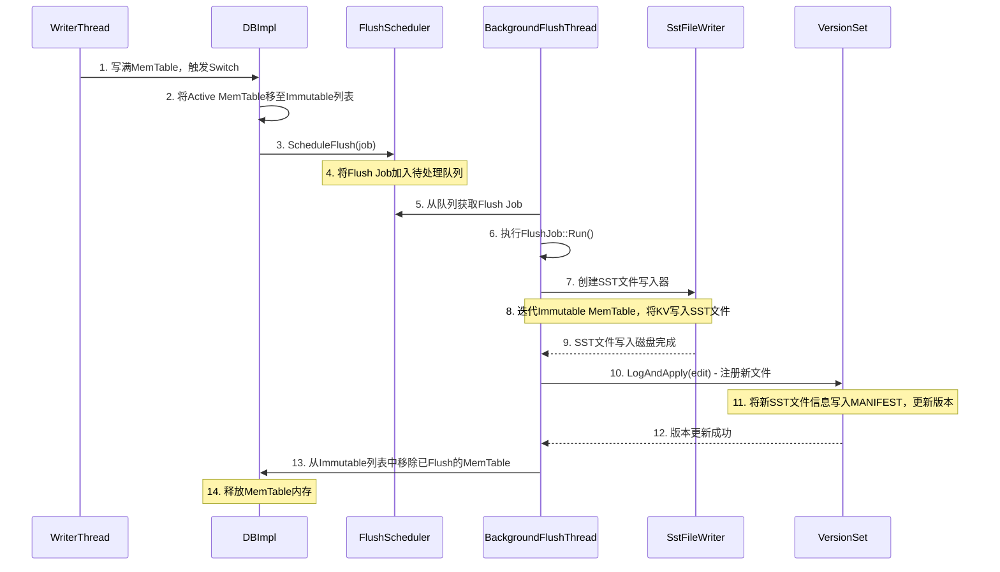
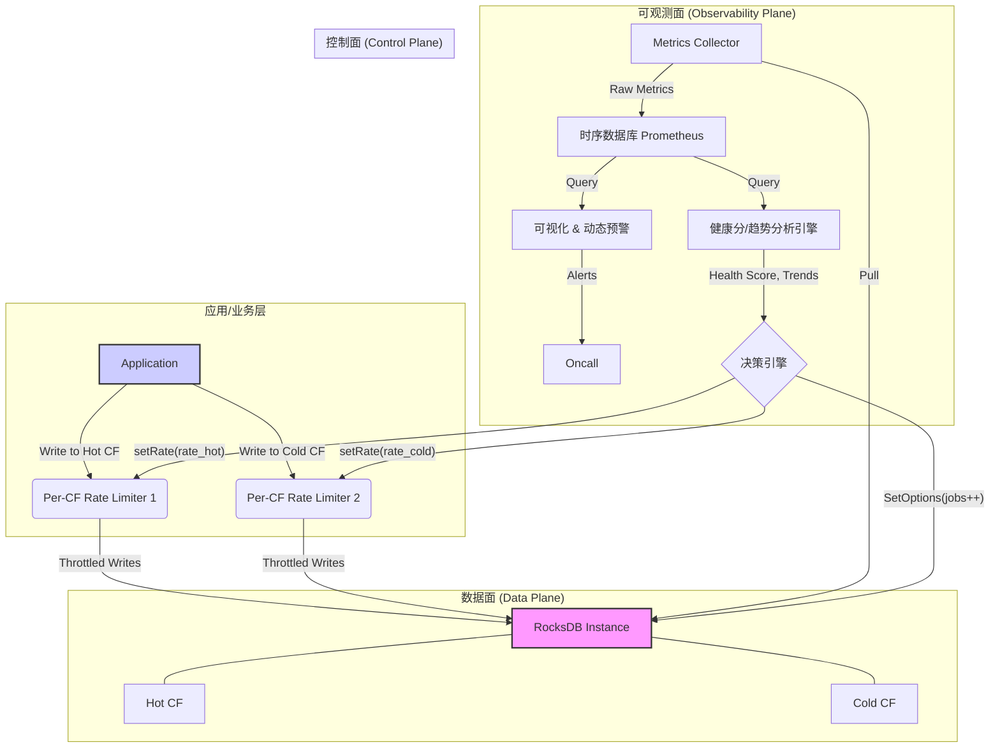

# RocksDB运维可观测与自愈：从指标到自动限速/写停治理

## 前言：为何RocksDB会“暂停服务”？

RocksDB作为业界领先的高性能嵌入式键值数据库，被广泛应用于分布式数据库、消息队列、监控系统等核心场景。它凭借其优异的写入性能和灵活的配置，支撑了海量数据的存储与访问。然而，许多经验丰富的运维工程师和架构师都遇到过一个棘手的问题：线上的RocksDB实例有时会突然出现性能“断崖”，写入延迟急剧升高，甚至完全停滞，业务层面则表现为请求超时、队列堆积、系统雪崩。这种现象，就是本文将要深入探讨的核心——**写停（Write Stall）**。

写停并非Bug，而是RocksDB的一种内置的、悲壮的自我保护机制。它像一个熔断开关，当内部数据处理的压力达到临界点时，主动暂停前端的写入请求，以防止整个系统因过载而崩溃。但是，频繁或长时间的写停对业务是不可接受的。

本文旨在回答一个核心问题：**如果线上频繁出现写停（stall）和 compaction backlog，如何基于 RocksDB 暴露的统计与事件（如 `rocksdb.num-immutable-mem-table`、`rocksdb.pending-compaction-bytes`、`rocksdb.stall-micros`）做 自动限速（RateLimiter auto_tuned）、后台并发自适应 与 预警阈值重构？**

我们将通过十余个章节，深入RocksDB的源码，结合UML时序图，从问题的根源出发，逐步构建一个完整的、从事后分析到事前预测、从被动响应到主动干预的运维可观测与自愈体系。

---

## 第一章：问题陈述——深入理解RocksDB写停（Write Stall）的根源

在深入解决方案之前，我们必须对问题本身有精准的理解。写停不是一个孤立的事件，它是RocksDB内部一系列状态失衡的最终外在表现。

### 1.1 定义：什么是写停（Stall）与Compaction Backlog？

*   **写停 (Write Stall)**：指RocksDB为了维持内部数据结构的稳定，主动、强制性地延迟甚至阻塞用户写入线程（`Put`, `Write`, `Delete`等操作）的现象。当Stall发生时，应用层面的写入请求会发现延迟急剧增加，因为它们在等待RocksDB的“许可”。`rocksdb.stall-micros`这个统计指标就是专门用来度量写停总时长的。

*   **Compaction Backlog（压实积压）**：指待执行的Compaction任务的数据总量，远超出了后台Compaction线程的处理能力，从而导致数据不断堆积。这个积压的“债务”通常以字节大小衡量，即`rocksdb.pending-compaction-bytes`。Compaction Backlog是导致写停的最核心、最直接的原因之一。

这两者紧密相关：**Compaction Backlog是因，Write Stall是果**。后台处理不过来，数据就越堆越多；为了不让系统被压垮，只能让前面写数据的“慢一点，等一等”。

### 1.2 根源：LSM-Tree架构的“原罪”

写停的根源，深植于RocksDB所采用的**日志结构合并树（Log-Structured Merge-Tree, LSM-Tree）** 架构中。LSM-Tree的设计哲学是“牺牲读性能，优化写性能”，它通过将随机写转化为顺序写，极大地提升了写入吞吐。但这份“礼物”背后，早已标好了价格。

LSM-Tree的核心工作流如下：
1.  **写入内存 (MemTable)**：当一个写请求到达时，数据首先被写入内存中的一个有序数据结构——`MemTable`，同时为了持久化，会顺序写入一个预写日志（Write Ahead Log, WAL）。这一步非常快，因为完全是内存和顺序磁盘操作。
2.  **刷盘到L0 (Flush)**：当`MemTable`写满后，它会变成一个只读的`Immutable MemTable`。后台的`Flush`线程会将其中的数据持久化到磁盘，形成一个静态的、有序的SST（Sorted String Table）文件，通常存放在Level 0（L0）层。
3.  **后台合并 (Compaction)**：随着时间推移，L0层的SST文件会越来越多。为了：
    *   **优化读性能**：减少查询时需要检查的文件数量。
    *   **回收空间**：清理被覆盖或删除的数据。
    *   **维持结构**：将数据从L0层逐步合并、迁移到更高层（L1, L2, ...）。
    后台的`Compaction`线程会不断地读取低层级的SST文件，合并它们，然后将结果写入到更高一级。

这个过程中，两个关键的“放大”效应是理解Stall的关键：

*   **写放大 (Write Amplification)**：用户的一次逻辑写入（`Put`一个Key），在LSM-Tree的生命周期中，可能导致多次物理磁盘写入。一次写入MemTable，一次Flush到L0，后续可能在L0->L1, L1->L2...的各级Compaction中被反复读取和重写。如果写放大系数是10，意味着后台Compaction的磁盘I/O压力是用户写入速率的10倍。
*   **空间放大 (Space Amplification)**：由于老版本的数据和已删除的数据不会立即消失，而是在Compaction过程中被逐渐清理，因此实际占用的磁盘空间会大于用户数据的真实大小。

### 1.3 “生产者-消费者”模型下的失衡

我们可以将RocksDB的写入和后台处理流程抽象为一个经典的“生产者-消费者”模型，这有助于我们更直观地理解Stall的发生机制。

*   **生产者 (Producer)**：应用层的工作线程。它们持续不断地产生新的数据，写入到MemTable中。其生产速率，就是应用的写入QPS。

*   **缓冲区/队列 (Buffer/Queue)**：
    1.  **Immutable MemTable列表**：当MemTable被写满后，会进入这个“待Flush”队列。`rocksdb.num-immutable-mem-table`指标反映了这个队列的长度。
    2.  **L0层文件**：Flush操作的产物，是Compaction操作的“原材料”。L0文件数量的增长，代表了Compaction的压力。
    3.  **Pending Compaction Bytes**：更广义的队列，代表了所有层级中等待被Compaction的数据总量。

*   **消费者 (Consumer)**：RocksDB的后台线程池。它们扮演两个角色：
    1.  **Flush线程**：消费`Immutable MemTable`，生产L0 SST文件。
    2.  **Compaction线程**：消费低层级的SST文件（尤其是L0），生产高层级的SST文件。

**写停的本质，就是生产者速率长时间、大幅度地超过了消费者的处理速率，导致缓冲区被填满，系统被迫进入反压（Back Pressure）状态。**

  *（后续章节将提供更详细的UML图）*

当`Immutable MemTable`队列太长、L0文件堆积过多、或者`Pending Compaction Bytes`超过阈值时，RocksDB会认为“消费者”已经不堪重负，再让“生产者”无限制地生产数据，将导致缓冲区溢出（系统崩溃）。因此，它必须介入，在写入路径上设置“红灯”，强制“生产者”减速或暂停——这就是写停。

理解了这一核心矛盾，我们后续所有治理方案的目标就变得非常明确：**通过监控“缓冲区”的状态，动态调节“生产者”的速率和“消费者”的能力，使得整个系统达到一种动态平衡，从而避免触发写停这个“红灯”。**

在下一章，我们将深入RocksDB的源码，从`DB::Put()`开始，详细剖析“生产者”是如何将数据放入系统的。

---

## 第二章：RocksDB写路径（Write Path）源码剖析

理解了写停是“生产”与“消费”失衡的后果后，我们首先需要精确掌握“生产”环节的每一个细节。一个简单的`DB::Put()`调用背后，隐藏着一套为了保证原子性、持久化和高并发而精心设计的复杂机制。

### 2.1 从API到MemTable：写操作的UML时序图

下图描绘了当客户端调用`DB::Put()`时，RocksDB内部核心的调用流程。为了提升并发性能，RocksDB引入了**Write Group（写组）**机制，即把多个并发的写请求合并成一个组，由一个“领导者”（Leader）线程代表整个组执行一次向下游（WAL、MemTable）的物理写入。

```mermaid
sequenceDiagram
    participant Client
    participant DB::Put()
    participant DBImpl::Write()
    participant WriteThread
    participant DBImpl::WriteImpl()
    participant WAL
    participant MemTable

    Client->>DB::Put(): 1. 发起写请求
    DB::Put()->>DBImpl::Write(): 2. 封装为WriteBatch并调用Write()
    Note over DBImpl::Write(), WriteThread: 3. 进入Write()方法，准备加入写组
    DBImpl::Write()->>WriteThread: 4. JoinBatchGroup(writer)
    alt 成为Leader
        WriteThread-->>DBImpl::Write(): 5a. 成为Leader，继续执行
        DBImpl::Write()->>DBImpl::WriteImpl(): 6. Leader执行核心写入逻辑
        DBImpl::WriteImpl()->>WAL: 7. WriteToWAL() 写入预写日志
        WAL-->>DBImpl::WriteImpl(): 返回成功
        DBImpl::WriteImpl()->>MemTable: 8. InsertIntoMemtable() 写入内存表
        MemTable-->>DBImpl::WriteImpl(): 返回成功
        DBImpl::WriteImpl()->>WriteThread: 9. 标记写组完成
        WriteThread->>DBImpl::Write(): 10. 唤醒所有Follower
    else 成为Follower
        WriteThread-->>DBImpl::Write(): 5b. 成为Follower，进入等待
        Note over DBImpl::Write(): ...等待Leader完成...
        WriteThread-->>DBImpl::Write(): 11. 被Leader唤醒，返回成功
    end
    DBImpl::Write()-->>Client: 12. 写入完成，返回
```

### 2.2 源码视角下的关键步骤拆解

#### 1. `DB::Put()` 与 `WriteBatch`

用户调用的`DB::Put()`是一个便利的API。在内部，即便是单个`Put`操作，也会被首先封装进一个`WriteBatch`对象中。

*   **`WriteBatch`**：它是RocksDB实现**原子性**写入的基础。一个`WriteBatch`可以包含多个`Put`、`Delete`操作。当这个`WriteBatch`被`DB::Write()`提交时，RocksDB保证其内的所有操作要么全部成功，要么全部失败，不会出现部分写入的情况。这是通过在写入WAL和MemTable之间加锁来实现的。

#### 2. `DBImpl::Write()` 与 `WriteThread` (写组机制)

这是整个写路径的“咽喉”要道。`DBImpl::Write()`的核心职责是协调并发写入，其精髓在于`write_thread_`。

*   **`WriteThread`**：它实现了**写组（Write Group）**的逻辑。当多个应用线程并发调用`DBImpl::Write()`时：
    *   第一个到达的线程成为**Leader**。
    *   后续到达的线程成为**Followers**，它们会将自己的`WriteBatch`合并到Leader的`WriteBatch`中，然后进入条件变量等待。
    *   Leader线程“代表”整个组，执行一次向WAL和MemTable的写入。这被称为**一次“群提交”（Group Commit）**。
    *   写入完成后，Leader负责唤醒所有Followers。

这种机制极大地提升了写入吞吐量。它将多次小写入的锁竞争和磁盘同步（如果`sync`选项开启）开销，摊平成了一次大写入的开销，显著降低了线程切换和系统调用的频率。

#### 3. `DBImpl::WriteImpl()`：核心写入逻辑

只有Leader线程才会执行此函数。它负责“真正”的写入工作，主要做两件事，顺序至关重要：

1.  **`WriteToWAL()` - 写入预写日志**：
    *   **目的**：保证**持久性（Durability）**。
    *   **过程**：将整个`WriteBatch`的内容序列化后，作为一个单独的Record，顺序追加到当前的WAL文件中。如果`WriteOptions::sync`被设置为`true`，这里还会执行`fsync`操作，确保数据落盘。
    *   **重要性**：只要成功写入WAL，即使数据库在写入MemTable后立刻宕机，重启时也可以通过回放WAL来恢复数据，保证数据不丢失。

2.  **`InsertIntoMemTable()` - 写入内存表**：
    *   **目的**：为**读服务（Serving Reads）**提供最新数据，并为后续的Flush做准备。
    *   **过程**：`WriteBatch`在这里被“解开”，其内部的每一个`Put`或`Delete`操作，都会被逐一应用到`MemTable`中。
    *   **`MemTable`**：其默认实现是一个**跳表（SkipList）**，这是一个高效的、支持并发读写的有序数据结构。写入MemTable意味着数据对后续的读请求立即可见（如果读请求设置了`read_your_own_writes`）。

### 2.3 关键数据结构

*   **`ColumnFamilyData` (CFD)**：RocksDB支持多列族（Column Family, CF）。每个CF拥有自己独立的`MemTable`、`Immutable MemTable`列表和SST文件集合。`ColumnFamilyData`就是管理某个特定CF所有这些资源的“总管家”。写操作总是针对某个CF的。

*   **`MemTable`**：如前所述，是内存中的数据副本，为读写提供服务。它的生命周期是：`Active MemTable` -> (写满后) -> `Immutable MemTable` -> (Flush后) -> 被销毁。

至此，我们完成了对“生产”过程的解剖。一个写请求，通过写组机制被高效地批量处理，在WAL的保护下实现了持久化，并最终在MemTable中“安家落户”，等待着被后续的Flush和Compaction过程消费。

这个过程本身是高效的。然而，当写入速率过快，导致`MemTable`被迅速填满并转化为`Immutable MemTable`的速度，超过了后台Flush线程的处理速度时，麻烦就开始了。在下一章，我们将聚焦于这个承上启下的关键环节——Flush。

---

## 第三章：从MemTable到L0：Flush机制的源码之旅

Flush是LSM-Tree承上启下的核心步骤。它负责将内存中滚热的`MemTable`数据，冷却并固化成磁盘上不可变的SST文件。这个过程的效率，直接决定了RocksDB能以多快的速度“消化”掉写入的数据，为新的写入腾出内存空间。

### 3.1 Flush的触发时机

Flush并非随时都在发生，它由一系列明确的条件触发。理解这些触发器，是理解系统何时开始感到“压力”的第一步。

1.  **MemTable写满（`write_buffer_size`）**: 这是最常见和最主要的触发条件。当一个`Active MemTable`的已用空间达到用户配置的`write_buffer_size`时，它将被切换为`Immutable MemTable`，并一个Flush任务将被调度。
2.  **CF的MemTable总数超限（`max_write_buffer_number`）**: 为了控制单个列族（Column Family）的内存占用，`max_write_buffer_number`参数限制了该CF下`Active MemTable`和`Immutable MemTable`的总数。当写入一个新`MemTable`后将导致总数超限时，RocksDB会强制触发一次Flush，以尽快清理掉一个`Immutable MemTable`。这是一个重要的反压信号。
3.  **手动触发（`DB::Flush()`）**: 用户可以主动调用`Flush` API来强制刷盘。这通常用于测试、数据备份或需要确保某些数据已完全持久化到SST文件的场景。
4.  **WAL文件总大小超限（`max_total_wal_size`）**: 为了便于回收旧的WAL日志文件，当WAL文件总大小超过`max_total_wal_size`时，RocksDB会选择持有最老日志记录的那个CF进行Flush。Flush完成后，对应的WAL日志就可以被安全地归档或删除了。

### 3.2 MemTable的“变身”：Switch与调度

当上述任一条件满足时，RocksDB需要执行一次**MemTable Switch**操作。这是一个必须在锁保护下完成的原子操作，以确保数据一致性：

1.  **加锁**：获取数据库的全局锁，暂停所有写入。
2.  **切换**：当前的`Active MemTable`被放入它所属的`ColumnFamilyData`的`Immutable MemTable`列表中（`imm_`）。
3.  **新生**：一个新的、空的`MemTable`被创建，并成为新的`Active MemTable`。
4.  **调度**：一个Flush请求被封装并提交给后台的`FlushScheduler`。
5.  **解锁**：释放锁，新的写入可以进入全新的`Active MemTable`。

这个切换过程非常快。但最关键的一步是，**`Immutable MemTable`的数量增加了**。这正是`rocksdb.num-immutable-mem-table`这个核心监控指标的来源。该指标的数值，精确地反映了“**有多少个MemTable已经写满，正排队等待被Flush线程处理**”。它是衡量Flush压力最直观的“队列长度”指标。

### 3.3 Flush Job的执行：从内存到SST文件

下图展示了从调度到完成一个Flush任务的完整流程。



**核心执行步骤拆解**：

1.  **调度与拾取**：`DBImpl`将一个`FlushJob`放入`FlushScheduler`的队列中。后台专门的Flush线程（其数量由`max_background_flushes`控制，在`max_background_jobs`总数内）会从这个队列中取出任务来执行。
2.  **数据写入**：Flush线程的核心工作是调用`BuildTable()`函数。它会：
    *   创建一个`SstFileWriter`实例。
    *   获取`Immutable MemTable`的一个内部迭代器（Iterator）。
    *   遍历`MemTable`中的所有键值对，并按照其顺序写入`SstFileWriter`。
    *   `SstFileWriter`负责处理所有SST文件的格式细节，包括数据块、索引块、Filter块等的构建和压缩。
    *   完成后，一个全新的、位于L0层的SST文件就在磁盘上诞生了。
3.  **元数据更新（关键一步）**：新生成的SST文件还不能被读取，因为它还没有被注册到数据库的“户口本”里。这一步通过`VersionSet::LogAndApply()`实现：
    *   一个`VersionEdit`对象被创建，记录着“在哪个CF的哪个Level，新增了哪个SST文件”。
    *   这个`VersionEdit`被写入到`MANIFEST`文件中。`MANIFEST`是RocksDB的事务日志，记录了所有SST文件的变动历史。
    *   `MANIFEST`写入成功后，新的数据库元信息（`Version`）在内存中生效。至此，新的SST文件才正式成为数据库的一部分，对读请求可见。
4.  **清理工作**：一旦新的`Version`生效，就意味着`Immutable MemTable`中的数据已经安全地持久化到了SST文件。RocksDB现在可以安全地将这个`Immutable MemTable`从内存列表中移除，并释放其占用的内存。`rocksdb.num-immutable-mem-table`指标减1。

至此，我们完成了LSM-Tree中从内存到磁盘的第一次数据转换。Flush过程本身是后台异步的，但它的处理能力直接决定了`Immutable MemTable`这个队列的长度。如果写入速度持续高于Flush速度，队列将不断变长，最终触及`max_write_buffer_number`的限制，从而引发**写停（Stall）**。

Flush的产物——L0层的SST文件，又成为了下一阶段——Compaction——的输入。在下一章，我们将深入探讨这个更复杂、开销也更大的后台过程。

---

## 第四章：Compaction（压实）的核心逻辑与挑战

Compaction是RocksDB后台工作的“重头戏”，它消耗大量的CPU和磁盘I/O，是系统性能的主要瓶颈来源。然而，Compaction又是不可或缺的，它是维持LSM-Tree健康、高效运行的基石。

### 4.1 Compaction的目标：为何要“自讨苦吃”？

RocksDB花费巨大的代价进行Compaction，主要为了达成三个核心目标：

1.  **降低读放大（Read Amplification）**：Flush操作产生的SST文件都在L0层。L0层的文件之间键范围（Key Range）可能存在重叠。这意味着一次读请求，在最坏情况下，需要查询L0中的**所有**文件，才能确定一个键是否存在。随着L0文件增多，读性能会急剧恶化。Compaction会将L0的多个文件合并，并与L1中键范围重叠的文件进行合并，最终在L1生成新的、键范围互不重叠的文件。这样，一次读请求在L1最多只需要访问一个文件，极大地提升了读取效率。
2.  **回收磁盘空间（Space Amplification）**：在LSM-Tree中，对一个键的更新（Update）或删除（Delete）操作，并不会立即修改或删除旧数据。更新操作是插入一个更新的、带有更高版本号的记录；删除操作是插入一个特殊的“墓碑标记”（Tombstone）。这些旧的、无效的数据依然占据着磁盘空间。只有在Compaction过程中，当合并多个SST文件时，RocksDB才会判断哪些键已被新版本覆盖、哪些键已被标记为删除，并最终在生成的新SST文件中将它们彻底清除，从而回收磁盘空间。
3.  **维持LSM-Tree结构**：Compaction是数据在LSM-Tree中从低层向高层“流动”的唯一途径。它维持着整个树形的健康结构，防止数据在某一层（尤其是L0）无限堆积。

### 4.2 两大主流风格：Level-Style vs. Universal-Style

RocksDB提供多种Compaction策略，其中最主流的是Level-Style和Universal-Style。

*   **Level-Style Compaction (默认)**：
    *   **结构**：数据被组织在多个层级（L0, L1, L2, ...）。L0层文件键范围可重叠，从L1层开始，每层内部的文件键范围互不重叠。每层都有一个目标大小，通常L(N+1)的目标大小是LN的`max_bytes_for_level_multiplier`倍（默认为10）。
    *   **过程**：一次Compaction通常会从Level `i`中选择一个文件，并找出它在Level `i+1`中所有键范围重叠的文件，将它们一起合并，生成的新文件会放入Level `i+1`。
    *   **优缺点**：读性能好（除L0外，每层最多查一个文件），空间放大率较低。但写放大相对较高，因为数据在下沉过程中可能被多次重写。**这是绝大多数场景下的默认和推荐选择**。

*   **Universal-Style Compaction**：
    *   **结构**：所有SST文件都在逻辑上的L0层，它们被组织成一个或多个“有序运行”（Sorted Runs），每个运行内的文件键范围不重叠。
    *   **过程**：当文件数量达到一定阈值时，Compaction会选择几个相邻的文件，将它们合并成一个更大的新文件，仍然放在L0。
    *   **优缺点**：写放大较低，适合写入密集型或TTL（Time-to-Live）场景。但读放大和空间放大相对较高。

本文后续的讨论将主要围绕**Level-Style Compaction**展开，因为它与写停的关联机制最为经典和复杂。

### 4.3 Compaction任务的拾取与执行

Compaction是由后台线程池（由`max_background_jobs`或`max_background_compactions`控制）异步执行的。其核心循环位于`DBImpl::BackgroundCompaction()`中。

1.  **`DBImpl::BackgroundCompaction()`循环**：
    *   后台线程被唤醒（通常由Flush完成或另一个Compaction完成后触发）。
    *   调用`PickCompaction()`来“挑选”当前最需要执行的Compaction任务。
    *   如果`PickCompaction()`返回了一个任务，则执行它。
    *   执行完毕后，循环继续，再次尝试拾取新任务。

2.  **`VersionSet::PickCompaction()`：决策大脑**：
    这是决定Compaction“火烧眉毛”程度的核心。它通过计算一个“分数”（Score）来评估每个Level的Compaction紧迫性：
    *   **L0的紧迫性**：如果L0的文件数量超过`level0_slowdown_writes_trigger`，分数会大于1.0，分数会随文件数增加而增加。这是最高优先级的信号。
    *   **其他Level的紧迫性**：对于L1及以上层级，分数的计算方式是 `该Level的总大小 / 该Level的目标大小`。例如，L1的目标大小是256MB，但现在总大小达到了300MB，其分数就是`300/256 > 1.0`。
    *   `PickCompaction()`会选择分数最高的那个Level，并为其生成一个Compaction任务。

3.  **执行Compaction**：
    一旦任务被选中，后台线程就开始执行。它会创建一个`Compaction`对象，该对象包含了所有输入文件（来自Level `i`和Level `i+1`）和输出Level。执行过程大致为：
    *   为所有输入文件创建迭代器。
    *   使用`MergingIterator`将这些迭代器合并成一个单一的、有序的输入流。
    *   遍历`MergingIterator`，在遍历过程中处理被覆盖的键和删除标记。
    *   将有效数据写入到为输出Level创建的一个或多个`SstFileWriter`中。
    *   最后，和Flush一样，通过`VersionSet::LogAndApply()`将文件变动（删除了输入文件，新增了输出文件）记录到`MANIFEST`，使之生效。

### 4.4 解读核心指标：`rocksdb.pending-compaction-bytes`

这个指标是衡量Compaction积压（Backlog）的“官方”读数。它并不是简单地把所有文件加起来，而是基于上述的“分数”来计算的，更能反映系统的“债务”水平。

在Level-Style中，它的计算方式大致如下：
*   **对于L1及以上层级**：如果某一层（Level `i`）的总大小超过了它的目标大小，那么**超出目标大小的部分**就会被累加到`pending-compaction-bytes`中。
*   **对于L0层**：L0没有目标大小，它的压力由文件数体现。RocksDB会将L0的文件总大小，根据一个公式（与`level0_file_num_compaction_trigger`相关）换算后，也计入`pending-compaction-bytes`。

因此，`rocksdb.pending-compaction-bytes`的含义是：“**根据当前各Level的目标和实际大小，理论上需要被Compaction掉的数据总量**”。它是一个比L0文件数更全面的压力指示器，因为它综合了所有Level的积压情况。当这个值持续增长时，说明后台Compaction的处理速度已经跟不上数据的生成速度，系统正滑向失衡的边缘。

Compaction是整个LSM-Tree体系中资源消耗最大的环节。它的成功与否，直接关系到上游的Flush是否有空间腾挪，以及更上游的写入是否会被阻塞。在下一章，我们将直面写停的“审判庭”——`DBImpl::DelayWrite()`函数，看看它是如何根据我们前面讨论的这些状态，最终做出“暂停写入”这个决定的。

---

## 第五章：写停（Stall）的“断点”：源码中的触发条件

至此，我们已经分析了所有可能导致系统“消化不良”的环节。现在，我们将进入整个写停机制的核心——`DBImpl::DelayWrite()`函数。在每次执行写入操作（`DBImpl::Write()`）的开始阶段，都会调用这个函数来检查数据库的“健康状况”。如果健康状况不佳，`DelayWrite()`会强制当前写入线程`sleep`一段时间，从而实现写入的减速（Slowdown）或暂停（Stop）。

`rocksdb.stall-micros`这个关键指标，正是在这个函数中被累加的。可以说，`DelayWrite()`就是所有写停逻辑的汇聚点和最终执行者。

在Level-Style Compaction下，主要有三大类条件（可细分为四种）会触发写停。我们称之为“写停的四骑士”。

### 5.1 第一骑士：Immutable MemTable数量过多

*   **源码条件**: `cfd->imm()->NumNotFlushed() >= cfd->options()->max_write_buffer_number`
*   **相关参数**: `max_write_buffer_number`
*   **触发逻辑**: 这是最直接的写停条件。它检查当前列族（`cfd`）的`Immutable MemTable`列表（`imm()`）中，尚未被Flush的`MemTable`数量（`NumNotFlushed()`），是否已经达到了配置的上限（`max_write_buffer_number`）。
*   **含义**: 这个条件意味着，MemTable的生产速度（由写入速率决定）已经远超Flush线程的消费速度。内存中用于写缓冲的“插槽”已经用尽。为了防止内存无限制增长，RocksDB必须暂停写入，等待后台Flush线程完成至少一个`Immutable MemTable`的刷盘，腾出位置后，写入才能继续。这是一种**基于内存反压的硬停止**。

### 5.2 第二骑士：L0层文件数过多（两阶段触发）

L0层文件的堆积是LSM-Tree健康状况的头号警报。RocksDB为此设计了“减速”和“停止”两级精细的流控策略。

#### 5.2.1 L0 Slowdown (减速)

*   **源码条件**: `vstorage->num_level_files(0) >= vstorage->l0_slowdown_writes_trigger()`
*   **相关参数**: `level0_slowdown_writes_trigger`
*   **触发逻辑**: 当L0的文件总数（`num_level_files(0)`）达到了“减速”触发值（默认为20），写操作会被人为地延迟一小段时间（通常是毫秒级）。延迟的时间会随着超出阈值的文件数量增多而变长。
*   **含义**: 这是一个**预警信号**。RocksDB认为L0->L1的Compaction压力正在显著增大，读取性能可能开始劣化。通过轻微地减慢写入，希望能给后台Compaction一点“喘息”之机，避免情况迅速恶化到需要硬停止的地步。

#### 5.2.2 L0 Stop (停止)

*   **源码条件**: `vstorage->num_level_files(0) >= vstorage->l0_stop_writes_trigger()`
*   **相关参数**: `level0_stop_writes_trigger`
*   **触发逻辑**: 当L0的文件总数达到了“停止”触发值（默认为36），写操作会遭遇长时间的延迟，接近于完全阻塞。
*   **含义**: 这是一个**红色警报**。L0文件堆积已经非常严重，读放大和Compaction压力都已达到危险水平。此时必须强制停止写入，全力让后台线程进行L0->L1的Compaction，直到L0文件数下降到阈值以下。

### 5.3 第三骑士：Pending Compaction Bytes过高（两阶段触发）

`pending-compaction-bytes`是衡量整个LSM-Tree Compaction“债务”的全局指标。同样，它也拥有两级流控。

#### 5.3.1 Pending Bytes Slowdown (减速)

*   **源码条件**: `vstorage->pending_compaction_bytes() > soft_pending_compaction_bytes_limit`
*   **相关参数**: `soft_pending_compaction_bytes_limit`
*   **触发逻辑**: 当待压实的总字节数超过了用户设定的“软限制”时，触发写入减速。
*   **含义**: 这个指标比L0文件数更全面，它反映了所有Level的累积压力。超过软限制说明整个系统的Compaction能力开始跟不上数据累积速度。减速写入是为了降低新“债务”的产生速度。

#### 5.3.2 Pending Bytes Stop (停止)

*   **源码条件**: `vstorage->pending_compaction_bytes() > hard_pending_compaction_bytes_limit`
*   **相关参数**: `hard_pending_compaction_bytes_limit`
*   **触发逻辑**: 当待压实的总字节数超过了“硬限制”时，触发写入硬停止。
*   **含义**: 系统已经处于严重的Compaction Backlog状态。如果不暂停写入，新数据将持续涌入一个本已不堪重负的系统，可能导致性能雪崩（例如，Compaction落后太多，导致磁盘空间被快速耗尽）。

### 5.4 写停时长与`rocksdb.stall-micros`

当上述任何一个条件被触发时，`DelayWrite()`会计算一个延迟时间，并调用`env_->SleepForMicroseconds()`。这个`sleep`的时长，会被精确地累加到`DBStats`中的各种`stall_micros`计数器上。

例如：
*   由L0文件数过多导致的减速，会计入 `rocksdb.stall.level0.slowdown.micros`。
*   由`Immutable MemTable`数量过多导致的停止，会计入 `rocksdb.stall.memtable.compaction.micros`。
*   总的写停时间，会计入 `rocksdb.stall-micros`。

通过监控这些细分的Stall指标，我们就能精确地知道是哪个“骑士”导致了写停，从而为我们的调优和治理指明了方向。

至此，我们已经完整地剖析了RocksDB从写入到Flush、Compaction，再到最终触发写停的整个因果链条。接下来的章节，我们将从“问题分析”转向“解决方案”，探讨如何利用我们学到的知识，构建一套自动化的治理体系。

---

## 第六章：治理方案(一)：基于速率匹配的“安全写入速率”模型

在第五章，我们看到RocksDB的写停机制是一种**被动的、基于阈值的反压**。它只有在系统状态已经恶化到某个临界点时才介入，这种“悬崖式”的制动往往会导致业务性能的剧烈抖动。更理想的治理方案应该是一种**主动的、基于速率的流控**，它能预测并避免系统进入危险状态。

本章的目标，就是回答那个核心的追问：**如何计算“安全写入速率上限”？**

### 6.1 核心思想：速率匹配（Rate Matching）

让我们再次回到第一章的“生产者-消费者”模型。系统保持稳定的根本条件是：**在宏观时间尺度上，生产者的生产速率必须小于或等于消费者的消费速率。**

*   **生产速率**：应用的写入速率，单位通常是 Bytes/sec。
*   **消费速率**：后台Flush和Compaction处理数据的速率，即**后台总吞吐量**，单位也是 Bytes/sec。

任何长时间违反 `写入速率 ≤ 后台处理速率` 的行为，都必然导致“缓冲区”（Immutable MemTables, L0文件, Pending Compaction Bytes）的无限增长，并最终触发写停。

因此，我们的核心思想就是**速率匹配**：通过实时计算后台的处理能力，来动态地调整前端的写入速率，使其互相匹配。

### 6.2 “安全写入速率”的计算模型

一个理想的“安全写入速率” (`SafeWriteRate`) 不是一个固定的值，而是一个动态调整的函数，它主要由两个核心变量决定：**系统的基线处理能力**和**当前的积压水平**。

我们可以构建如下的概念模型：

`SafeWriteRate = BaseCompactionRate * BacklogAdjustmentFactor`

#### 6.2.1 第一部分：计算基线处理能力 (`BaseCompactionRate`)

这是模型的基石，代表了在当前硬件和负载下，RocksDB后台Compaction的最大持续处理能力。

*   **如何衡量？**
    最直接的指标是 `rocksdb.compacted-bytes`。这是一个累计值，记录了自数据库启动以来总共完成了多少字节的Compaction。通过周期性地（例如每分钟）采集这个值，我们可以计算出它的变化率，即**近期平均Compaction速率**。

    `BaseCompactionRate (Bytes/sec) = (compacted_bytes_t2 - compacted_bytes_t1) / (t2 - t1)`

    这个值反映了在当前系统状态下，消费者的真实“消化能力”。例如，我们可能计算出，过去5分钟内，系统的平均Compaction速率是 50 MB/sec。

#### 6.2.2 第二部分：计算积压调整因子 (`BacklogAdjustmentFactor`)

如果系统没有任何积压，那么理论上我们可以允许写入速率达到`BaseCompactionRate`。但如果系统已经存在积压，我们就必须让写入速率**低于**处理速率，才能让系统有机会“偿还债务”。反之，如果系统非常空闲，我们甚至可以允许短暂的突发写入超过处理速率。

`BacklogAdjustmentFactor` 就是这样一个动态的、范围通常在 `[0, 1.x]` 之间的调整系数。它由我们前面讨论过的“队列长度”指标决定：

*   `rocksdb.num-immutable-mem-table`
*   L0文件数
*   `rocksdb.pending-compaction-bytes`

我们可以设计一个函数 `g()`，将这些积压指标映射为一个调整因子：

`BacklogAdjustmentFactor = g(num_imm_memtables, num_l0_files, pending_bytes)`

这个`g()`函数的设计是整个策略的核心，它可以是一个简单的分段函数，也可以是一个平滑的PID控制器。一个简单的分段函数示例如下：

*   **安全区**：当所有积压指标都处于低位时（例如, `pending_bytes < 20% * soft_limit`），`Factor = 1.0`。允许写入速率匹配处理速率。
*   **警告区**：当任一积压指标进入中等水平（例如, `pending_bytes > 50% * soft_limit`），`Factor`开始线性下降。例如，可以设计成 `Factor = 1.0 - 0.8 * (pending_bytes / hard_limit)`。这意味着积压越高，允许的写入速率折扣打得越狠。
*   **危险区**：当任一积压指标接近硬停止阈值时（例如, `pending_bytes > 90% * hard_limit`），`Factor`可能需要被强制设为一个很小的值，如 `0.1`，实行非常严格的限流，以避免触发硬停。

### 6.3 动态反馈控制循环

将上述模型整合起来，我们就得到了一个完整的动态反馈控制循环：

1.  **监控 (Measure)**：
    *   周期性采集 `rocksdb.compacted-bytes`，计算出 `BaseCompactionRate`。
    *   实时采集 `rocksdb.num-immutable-mem-table`, L0文件数, `rocksdb.pending-compaction-bytes`。

2.  **决策 (Decide)**：
    *   根据采集到的积压指标，通过`g()`函数计算出当前的 `BacklogAdjustmentFactor`。
    *   计算最终的 `SafeWriteRate = BaseCompactionRate * BacklogAdjustmentFactor`。

3.  **执行 (Actuate)**：
    *   将计算出的 `SafeWriteRate` (Bytes/sec) 设置到一个外部的速率限制器（Rate Limiter）中。
    *   所有写入RocksDB的业务请求，都必须先通过这个速率限制器。

通过这个闭环系统，我们不再被动地等待Stall的发生，而是主动地将写入速率控制在一个动态计算出的“安全水位”上。当后台处理能力因某些原因（如CPU争抢、磁盘I/O抖动）下降时，`BaseCompactionRate`会自然下降，从而自动降低写入速率上限。当写入压力增大导致积压时，`BacklogAdjustmentFactor`会介入，进一步收紧流控。

这个模型为我们实现精细化的自动限速打下了坚实的理论基础。在下一章，我们将探讨如何利用RocksDB内置及外部的`RateLimiter`，来实践这一模型。

---

## 第七章：治理方案(二)：自动限速（RateLimiter）的实现与优化

计算出“安全写入速率”只是第一步，我们还需要一个可靠的机制来**执行**这个速率限制。本章将深入探讨用于此目的的核心工具——`RateLimiter`，分析其内置的`auto_tuned`模式，并最终导向一个更优的外部控制器方案。

### 7.1 RocksDB内置`RateLimiter`解析

RocksDB提供了一个内置的`RateLimiter`，其基本原理是**令牌桶算法（Token Bucket）**。

*   **工作机制**：想象一个桶，系统会以恒定的速率（rate）向桶里放入令牌（tokens）。当一个操作（如I/O请求）需要执行时，它必须从桶里获取与其大小相应的令牌数。如果桶内令牌足够，操作可以立即执行；如果不够，操作就必须等待，直到桶里积攒够足够的令牌。

*   **一个常见的误区**：默认情况下，当用户在`DBOptions`中设置了一个`RateLimiter`时，这个限速器主要用于**限制后台任务（Flush和Compaction）的I/O带宽**，而不是限制用户的写入速率。其设计初衷是为了降低RocksDB后台繁重I/O对同机部署的其他服务的干扰。它本身并不能直接阻止写停。

### 7.2 内置的`auto_tuned`模式

为了实现一定程度的自适应，RocksDB为`RateLimiter`引入了`auto_tuned`模式。这是一个更智能的内置限速器，它尝试根据数据库的健康状况自动调整令牌发放的速率。

*   **核心反馈信号**：`auto_tuned`模式的主要反馈信号是**写停事件**。在第五章我们知道，当`DBImpl::DelayWrite()`被触发时，就意味着系统过载。RocksDB会将这个“我停了”（I am stalled）的信号通知给`auto_tuned`的`RateLimiter`。

*   **控制逻辑**：其内部逻辑可以简化为一个简单的状态机：
    1.  **稳定状态 (Stable)**：当没有写停事件发生时，`auto_tuned`会缓慢地、持续地提升自己的速率上限，以此来探测系统的最大吞吐能力。
    2.  **压力状态 (Pressure)**：一旦收到写停信号，`auto_tuned`会立即大幅度地降低速率上限，以求快速缓解系统压力。
    3.  **恢复 (Recovery)**：在降低速率后，它会观察一段时间。如果写停不再发生，它就认为系统已经恢复，并重新回到稳定状态，开始下一轮的“爬坡”探测。

    ```mermaid
    graph TD
        A[稳定状态: 缓慢提升速率] -- 收到Stall信号 --> B(压力状态: 大幅降低速率);
        B -- 观察期内无Stall --> A;
    ```

### 7.3 `auto_tuned`模式的局限性

尽管`auto_tuned`模式比固定速率的限速器前进了一大步，但它依然有其固有的局限性：

1.  **事后响应，而非事前预测**：它的调整是**基于已发生的写停**。这意味着，为了让它工作，我们必须先让系统“受伤”（发生Stall），它才能介入治疗。我们的目标是完全避免Stall，而不是在Stall发生后亡羊补牢。
2.  **反馈信号单一**：它的主要输入是“是否Stall”这样一个二元信号，无法感知“压力的程度”。例如，它不知道`pending_compaction_bytes`是刚刚超过软限制，还是已经濒临硬限制，因此它的降速调整可能是“一刀切”的，不够精细。
3.  **控制逻辑黑盒**：其内部的速率调整算法是固定的，用户很难根据自己的业务特性去定制。

### 7.4 构建更优的外部自动限速控制器

要克服内置`auto_tuned`的局限性，实现第六章提出的精细化模型，我们需要构建一个**外部的、应用层**的自动限速控制器。

这个控制器的架构如下：

```mermaid
graph TD
    subgraph 监控决策服务
        A[Metrics Scraper] -- 周期性拉取 --> B(RocksDB Stats);
        A -- Metrics --> C{决策引擎};
        C -- "SafeWriteRate = f(metrics)" --> D[计算目标速率];
    end

    subgraph 应用服务
        E[业务请求] --> F{外部RateLimiter};
        F -- 通过/阻塞 --> G[DB::Write()];
    end

    D -- "setRate(new_rate)" --> F;
```

**组件说明**：
1.  **Metrics Scraper (监控采集器)**：一个独立的线程或进程，通过RocksDB的`GetProperty`接口或`Statistics`对象，定期采集我们关心的所有指标（`compacted-bytes`, `pending-compaction-bytes`, L0文件数等）。
2.  **决策引擎 (Decision Engine)**：这是控制器的“大脑”，它完整实现了第六章的“安全写入速率”计算模型。它接收采集器送来的实时指标，计算出`BaseCompactionRate`和`BacklogAdjustmentFactor`，最终得到一个动态的`SafeWriteRate`。
3.  **外部RateLimiter**：这是一个位于**应用代码中**的限速器实例（例如Java Guava库的RateLimiter，或Go的`golang.org/x/time/rate`包）。所有的`DB::Write()`或`DB::Put()`调用，在执行前都必须先向这个限速器申请令牌。
4.  **控制通路**：决策引擎计算出新的`SafeWriteRate`后，通过调用外部RateLimiter的`setRate()`之类的方法，实时更新其速率。

**优势**：
*   **主动预测**：该架构基于积压趋势进行决策，能够在写停发生**之前**就收紧流控，实现“防患于未然”。
*   **信息全面**：决策所依赖的指标是全面的、多维度的，使得控制更为精细。
*   **逻辑白盒**：整个决策逻辑（第六章的模型）对开发者完全透明，可以任意定制和优化。

通过这种方式，我们将RocksDB本身（数据面）与我们的控制逻辑（控制面）进行了解耦，实现了一套远比内置`auto_tuned`模式更强大、更灵活的自愈系统。

---

## 第八章：治理方案(三)：避免“锯齿状”写停——后台并发自适应与优先级调度

仅仅限制写入速率（控制生产者），虽然能避免最坏情况的发生，但治标不治本，甚至可能牺牲了系统本可以达到的更高性能。一个更完备的治理方案，必须同时优化消费者——即后台的Flush和Compaction。本章将探讨两种高级的“消费者”优化策略：**自适应地调整后台并发**和**智能地调度Compaction优先级**。

### 8.1 “锯齿状”写停（Write Sawtooth）问题

在仅有被动写停机制或简单限流的系统中，我们经常会观察到一种典型的“锯齿状”性能曲线：
1.  **高速写入**：系统开始时很空闲，写入以极高的速率进行。
2.  **积压累积**：高速写入迅速填满MemTable，刷出大量L0文件，`pending_compaction_bytes`急剧上升。
3.  **触发写停**：后台处理能力跟不上，积压指标触及硬停阈值，写入速率“断崖式”下跌到接近零。
4.  **后台处理**：写入暂停，后台线程全力消化积压。
5.  **恢复**：积压被清理，写停解除，系统恢复高速写入，开始下一个“锯齿”循环。

这种模式对上层业务极不友好，因为它带来了周期性的、剧烈的性能抖动。我们的目标是通过更平滑的控制，消除这种锯齿。

### 8.2 策略一：后台并发自适应——动态增减“消费者”数量

后台处理能力（`BaseCompactionRate`）最直接的决定因素，就是后台线程的数量。RocksDB允许我们通过`max_background_jobs`（或在新版中细分为`max_background_flushes`和`max_background_compactions`）来配置。

一个固定的线程数很难适应变化的负载：
*   **设置过低**：在写入高峰期，处理能力不足，容易导致积压和写停。
*   **设置过高**：在写入低谷期，过多空闲的后台线程会造成不必要的CPU资源浪费。

因此，我们可以实现**后台并发的自适应调节**。

*   **实现逻辑**：
    1.  **定义状态**：基于积压指标（如`pending_compaction_bytes`），定义系统的几个状态，例如：
        *   **健康 (Healthy)**: `pending_bytes < 25% * hard_limit`。
        *   **承压 (Under-Pressure)**: `pending_bytes` 介于 `25%` 和 `75% * hard_limit`之间。
        *   **危险 (Critical)**: `pending_bytes > 75% * hard_limit`。
    2.  **动态调整**：建立一个简单的规则引擎，通过`DB::SetOptions()`接口动态调整后台线程数。
        *   当系统从“健康”进入“承压”状态时，说明当前消费者数量不足，应**增加**`max_background_compactions`的数量，提升处理能力。
        *   当系统进入“危险”状态时，应将后台并发数调至最大允许值，全力进行Compaction。
        *   当系统长时间（例如，持续5分钟以上）保持在“健康”状态时，可以**减少**后台线程数，释放资源。

*   **效果**：这种策略就像一个智能的超市收银系统，当排队的人变多时，就动态增开收银窗口。它通过增强消费者的能力，从根本上提升了系统的`BaseCompactionRate`，使得系统能够承载更高的写入速率，从而减少了触发限流或写停的频率。

### 8.3 策略二：Compaction优先级调度——让“消费者”更聪明

仅仅增加消费者数量是不够的，我们还需要让他们**做最正确的事**。并非所有Compaction任务都同等重要。例如，清理L0->L1的通道，远比合并L4->L5的数据更紧急，因为前者直接关系到是否会触发写停。

RocksDB的`compaction_pri`选项，就允许我们指导后台线程如何选择Compaction任务。

*   **`compaction_pri`**:
    *   `kByCompensatedSize` (默认值): 优先选择预估写入量最大的Compaction任务。这个策略旨在减少总的写放大，但对于缓解写停压力并非最优。
    *   `kOldestLargestSeqFirst`: 优先处理包含最老数据的文件，适用于TTL场景。
    *   `kMinOverlappingRatio`: **这是避免写停的关键设置**。此策略的核心思想是，优先执行那些“容易完成”且“至关重要”的任务。它会给L0->L1的Compaction赋予极高的优先级，特别是当L0文件数开始增多时。同时，在其他层级，它会选择那些与下一层重叠数据量最小的任务，因为这类任务需要读取和重写的数据更少，能更快完成。

*   **治理建议**：
    **将`compaction_pri`设置为`kMinOverlappingRatio`**。
    这个简单的配置项，能让RocksDB的后台工作变得“智能”得多。它确保了宝贵的后台I/O和CPU资源，被用在“刀刃上”——即疏通最容易导致写停的L0->L1瓶颈。

### 8.4 综合施策

将本章的策略与前几章的方案结合，我们得到一个更强大的自愈系统：
1.  **基础**：设置`compaction_pri = kMinOverlappingRatio`，让后台工作天然具备高优先级意识。
2.  **反应**：部署后台并发自适应策略，根据压力动态调整后台处理能力。
3.  **防线**：部署基于“安全写入速率”模型的外部限速器，作为防止系统过载的最后一道主动防线。

通过这套组合拳，我们可以有效地“削峰填谷”，将“锯齿状”的性能曲线，抚平成一条平滑的、运行在更高水位的高性能直线。

---

## 第九章：治理方案(四)：分CF限流与冷热数据分离

到目前为止，我们设计的治理方案都是针对整个RocksDB实例的，我们称之为“全局限流”。这在数据库只服务于单一业务的场景下是有效的。但在更复杂的系统中，一个RocksDB实例可能同时存储多种不同类型的数据，此时全局限流就可能导致“误伤友军”的“邻居吵闹”（Noisy Neighbor）问题。

### 9.1 何时需要“分CF限流”而非“整体限流”？

设想一个典型的场景，一个RocksDB实例内包含两个列族（Column Family）：
*   **`cf_critical`**: 存储核心的、低延迟要求的交易数据。其特点是写入量不大，但每次读写都必须快速响应。
*   **`cf_logging`**: 存储非核心的、高吞吐的日志数据。其特点是写入量巨大，但能容忍一定的延迟。

现在，如果`cf_logging`突然涌入海量写入，会导致整个DB实例的`pending_compaction_bytes`急剧上升。我们之前设计的**全局限流**系统会检测到这个总量的变化，并开始限制整个实例的写入速率。

**问题出现了**：`cf_critical`的写入，尽管它本身并没有产生任何压力，也会被无差别地限速。日志业务的突发流量，影响到了核心交易业务的服务质量（SLA）。这就是需要“分CF限流”的典型时刻。

**结论**：当一个RocksDB实例中存在多个业务（通常用CF隔离），且这些业务具有**不同的重要性、不同的SLA、或不同的负载特性**时，就需要从“整体限流”转向“分CF限流”，以实现资源的隔离和差分服务。

### 9.2 实现策略(一)：基于列族（CF）的资源隔离

实现分CF限流的第一步，也是最重要的一步，是**正确地使用CF来隔离工作负载**。

RocksDB的CF本身就是一种资源隔离的单元。每个CF拥有自己独立的：
*   MemTable和Immutable MemTable列表
*   SST文件
*   `write_buffer_size`, `max_write_buffer_number`等配置
*   Compaction队列

通过将不同特性的数据放入不同的CF，我们已经从物理上隔离了它们的资源竞争。例如，`cf_logging`的Compaction，并不会直接阻塞`cf_critical`的Flush。

### 9.3 实现策略(二)：分CF的外部限速器

有了CF的物理隔离，我们就可以在第七章设计的外部控制器基础上，实现逻辑上的限流隔离。

架构升级非常直接：将原先的**单个全局RateLimiter**，升级为**一个管理多个RateLimiter的Map**。

`Map<String, RateLimiter> cf_rate_limiters;`

*   **Key**: 列族的名称 (`cf_critical`, `cf_logging`)
*   **Value**: 一个独立的RateLimiter实例

**工作流程**：
1.  应用在写入数据前，根据其要写入的CF名称，从Map中获取对应的RateLimiter。
2.  向该CF专属的RateLimiter申请令牌。
3.  获取令牌后，再向RocksDB发起写入。
4.  可以保留一个“默认”的全局限速器，用于处理那些没有专属限速器的CF。

### 9.4 实现策略(三)：分CF的动态决策

对应的，我们的“决策引擎”也需要升级，从计算一个全局的`SafeWriteRate`，升级为**为每个需要精细控制的CF，独立计算其`SafeWriteRate`**。

*   **挑战**：像`rocksdb.pending-compaction-bytes`这样的全局指标，无法告诉我们压力具体来自哪个CF。
*   **解决方案**：我们需要采集更细粒度的、分CF的指标。
    *   通过`DB::GetMapProperty()`可以获取分CF的属性，如`rocksdb.num-files-at-level<N>`，我们可以针对特定CF查询其L0文件数。
    *   通过`DB::GetColumnFamilyMetaData()`可以获取某个CF的详细元数据，包括每一层的文件列表和大小，从而可以**为每个CF独立计算其`pending_compaction_bytes`**。

**新的决策逻辑**：
1.  决策引擎周期性地为`cf_critical`和`cf_logging`分别计算它们的积压情况。
2.  独立计算出`SafeWriteRate_critical`和`SafeWriteRate_logging`。
3.  将这两个不同的速率，分别设置到`cf_rate_limiters` Map中对应的RateLimiter实例上。

这样，`cf_logging`的写入风暴只会导致`SafeWriteRate_logging`被大幅调低，而`SafeWriteRate_critical`则几乎不受影响，从而保证了核心业务的稳定。

### 9.5 经典应用：冷热数据分离

分CF治理最经典的应用场景之一，就是**冷热数据分离**。

*   **Hot CF**：存放近期频繁访问的热数据。
    *   **策略**：可以配置更大的`write_buffer_size`，更宽松的限速策略，甚至可以关闭压缩以换取更低的CPU占用和延迟。其目标是**极致的性能**。
*   **Cold CF**：存放历史归档的冷数据。
    *   **策略**：可以配置更严格的限速，使用更高压缩比的压缩算法（如`ZSTD`），更小的`write_buffer_size`。其目标是**极致的成本效益**。

通过分CF限流和差分配置，我们可以确保对冷数据的批量导入或维护操作，永远不会影响到热数据的在线服务性能，实现了完美的隔离。

总结而言，从全局治理到分CF治理，是从“粗放式管理”到“精細化运营”的关键一步，对于保障复杂系统中核心业务的SLA至关重要。

---

## 第十章：监控与预警：构建新一代动态阈值系统

一个强大的自愈系统，不仅需要能够“动手”解决问题，还需要能够“看见”问题，甚至“预见”问题。传统的监控预警体系，往往是自愈能力建设中最薄弱的一环。

### 10.1 传统静态阈值的弊端

在很多系统中，对RocksDB的告警规则通常是这样的：
*   `ALERT IF rocksdb_pending_compaction_bytes > 100_GB`
*   `ALERT IF rocksdb_num_files_at_level0 > 30`

这种**静态阈值**的告警方式，存在几个致命缺陷：

1.  **一刀切，无法适应**：一个100GB的`pending_bytes`对于一个承载TB级数据、拥有高速NVMe盘的集群来说，可能只是正常的业务高峰；但对于一个只有百GB数据、使用普通SSD的实例来说，则可能意味着灾难。静态阈值无法适应不同规模、不同硬件、不同负载的实例。
2.  **告警风暴或麻木**：为了“宁可错杀，不可放过”，运维人员可能会将阈值设得很低。结果是在业务高峰期收到大量无意义的告警，久而久之形成“告警麻木”（Alert Fatigue）。反之，如果阈值设得太高，则失去了预警的意义。
3.  **知其然，不知其所以然**：告警只告诉你“L0文件数超过30个了”，但没有告诉你“为什么会超过30个”。是因为写入量暴增？还是因为Compaction变慢了？这种告警提供的信息量太低。

### 10.2 新范式(一)：基于趋势和变化率的告警

与其关心一个指标的**绝对值**，我们更应该关心它的**动态行为**。

**原则：告警于“持续恶化的趋势”，而非“超过某个点”。**

让我们来重构告警规则：

*   **旧告警**： `pending_compaction_bytes > 100GB`
*   **新告警 (示例1)**： `ALERT IF derivative(pending_compaction_bytes) > 10MB/s FOR 5m`
    *   **解读**：如果`pending_compaction_bytes`在过去5分钟内，以**持续高于10MB/s**的速度增长，就告警。
    *   **意义**：这个告警清晰地表明：**生产者速率持续地大于消费者速率**。这是一个根本性的失衡信号，远比一个固定的100GB阈值更有意义。

*   **旧告警**： `num_files_at_level0 > 30`
*   **新告警 (示例2)**： `ALERT IF avg_over_time(WriteRate_Bytes, 10m) > 1.2 * avg_over_time(CompactionRate_Bytes, 10m)`
    *   **解读**：如果过去10分钟的平均写入速率，持续高于平均Compaction速率的1.2倍，就告警。
    *   **意义**：这直接监控了我们在第六章建立的“速率匹配”模型。一旦模型失衡，立即告警，这是一个非常早期的、根本性的预警。

*   **新告警 (示例3)**：`ALERT IF pending_compaction_bytes > 50GB AND derivative(compacted_bytes) < 1MB/s FOR 5m`
    *   **解读**：如果积压已经很高（超过50GB），**并且**后台Compaction在过去5分钟内几乎没有进展（速率低于1MB/s），就告警。
    *   **意义**：这个告警能精准地发现“后台Compaction卡死”或“后台线程因某些原因（如磁盘满、坏盘）无法工作”这类致命问题。

### 10.3 新范式(二)：构建综合健康分（Health Score）模型

系统是否健康，往往不是由单个指标决定的。我们需要一个能综合评估所有关键指标的、更宏观的视角。这就是**健康分模型**。

*   **理念**：将多个关键的、归一化后的指标，通过加权平均，聚合成一个单一的、范围在0-100之间的“健康分”。100分代表完美健康，分数越低代表系统风险越高。

*   **构建步骤**：
    1.  **选取核心指标**：
        *   `pending_compaction_bytes`
        *   `num_files_at_level0`
        *   `num_immutable_mem_table`
        *   速率失衡比：`WriteRate / CompactionRate`
    2.  **指标归一化**：将每个指标的原始值，转换为0-1的百分比。例如，`pending_bytes`的归一化值可以是 `pending_bytes / hard_pending_compaction_bytes_limit`。
    3.  **分配权重**：根据各指标的重要性，为其分配权重（`w1`, `w2`, ...），权重总和为1。通常，`pending_bytes`和L0文件数的权重要高一些。
    4.  **计算健康分**：
        `HealthScore = 100 * (1 - (w1 * norm_pending_bytes + w2 * norm_l0_files + ...))`

*   **应用**：
    *   **告警**：告警规则变得极其简单和稳定：`ALERT IF HealthScore < 60`，`CRITICAL IF HealthScore < 40`。
    *   **可视化**：在监控大盘上，我们不再需要关注十几个纷乱的指标，而只需要看一条健康分曲线，运维效率大大提升。
    *   **自动化触发器**：这个健康分，可以直接作为我们前面设计的自愈系统（如自动限速、后台并发调整）的输入信号，实现更精准的控制。

通过从“静态阈值”到“动态趋势”，再到“综合健康分”的演进，我们才算真正构建起了现代化的“可观测性”，使我们能从被动地响应事故，转变为主动地、数据驱动地管理系统的健康。

---

## 第十一章：总结——构建一个完整的运维可观测与自愈闭环系统

经过前面十章的深入探索，我们已经从问题的根源出发，逐步构建了治理RocksDB写停和Compaction积压的各个关键模块。本章，我们将把这些模块有机地整合在一起，形成一个完整的、自动化的、闭环的运维可观测与自愈系统。

### 11.1 最终架构：一个三层闭环系统

下图是我们最终推荐的系统架构。它由数据面、可观测面和控制面三个核心层面构成，形成一个完整的反馈控制闭环。



**数据流与控制流解析**：

1.  **数据流 (业务写入)**：
    *   应用（`Application`）的写入请求，根据其业务类型（热数据/冷数据），被路由到对应的外部速率限制器（`Per-CF Rate Limiter`）。
    *   在获得令牌后，请求被发送到RocksDB实例（`RocksDB Instance`）中对应的列族（`Hot CF`/`Cold CF`）。

2.  **可观测流 (信息采集与分析)**：
    *   `Metrics Collector`持续地从RocksDB实例中拉取细粒度的统计信息（全局和分CF）。
    *   原始指标存入时序数据库（`TSDB`），用于事后分析和可视化（`Grafana`）。
    *   `HealthEngine`（或在TSDB的查询/告警规则中实现）对原始指标进行二次加工，计算出**趋势、变化率**和**综合健康分**。
    *   传统的静态告警和新的动态告警，通过`Grafana`发送给Oncall人员。

3.  **控制流 (自动决策与执行)**：
    *   `DecisionEngine`（决策引擎）是整个自愈系统的“大脑”。它接收来自`HealthEngine`的分析结果（如健康分）。
    *   **执行决策**：
        *   **调节油门**：基于第六、九章的模型，为每个CF计算出`SafeWriteRate`，并调用对应`RateLimiter`的`setRate()`方法进行更新。
        *   **强化引擎**：基于第八章的策略，当检测到压力持续增大时，通过`DB::SetOptions()`接口，动态增加`max_background_jobs`的数量。

### 11.2 核心理念的转变：从被动响应到主动治理

这个闭环系统所体现的，是一种运维理念的根本性转变：

| 特征 | 旧模式 (被动响应) | 新模式 (主动治理) |
| :--- | :--- | :--- |
| **时机** | 事后，问题已发生 | 事前，预测并避免问题 |
| **手段** | 人工介入，紧急修复 | 自动控制，持续调整 |
| **依据** | 静态阈值，经验主义 | 动态趋势，数据驱动 |
| **目标** | 救火，恢复服务 | 护航，保障SLA |
| **结果** | 性能抖动，锯齿状曲线 | 性能平滑，高位稳定 |

我们不再等待`level0_stop_writes_trigger`被触发，而是在`pending_compaction_bytes`刚刚表现出**持续增长的趋势**时，就开始平滑地、按比例地收紧写入速率。我们不再让系统陷入“写停-恢复”的恶性循环，而是通过动态增强后台能力，将性能稳定地维持在更高的水平上。

### 11.3 关键治理手段清单

作为全文的总结，以下是构建这套系统所依赖的核心技术和策略清单：

*   **可观测性**：
    *   **核心指标**：`num-immutable-mem-table`, `pending-compaction-bytes`, `num-files-at-level0`, `compacted-bytes`。
    *   **告警范式**：用**趋势、变化率**和**综合健康分**取代静态阈值。
*   **生产者端控制 (限速)**：
    *   **架构**：在应用层构建**外部、可动态调节**的速率限制器。
    *   **模型**：`安全速率 = 后台处理速率 * 积压调整因子`。
*   **消费者端优化 (后台)**：
    *   **并发**：根据系统压力，**动态调整**`max_background_jobs`。
    *   **效率**：设置`compaction_pri = kMinOverlappingRatio`，优先处理关键任务。
*   **差分服务 (隔离)**：
    *   **物理层**：用**列族（CF）**隔离不同SLA和负载特征的业务。
    *   **逻辑层**：实现**分CF的独立限速和差分配置**，防止“邻居吵闹”。

通过系统化地应用这些策略，我们就能够将一个难以预测、容易“发脾气”的RocksDB实例，驯化成一个高度自治、性能平稳、可预期的健壮存储基石。

---

## 第十二章：结论与未来工作

本文从RocksDB写停的根源出发，深入其写路径、Flush、Compaction的源码细节，剖析了写停发生的完整因果链。在此基础上，我们扬弃了传统的被动、静态的运维模式，提出并设计了一整套主动的、动态的、闭环的自愈和可观测体系。该体系以“速率匹配”为核心思想，通过外部控制器实现对写入速率的精准调节，同时结合后台并发自适应和优先级调度，实现了对系统生产和消费两端的全面治理。最后，通过引入分CF的差分服务策略和新一代的动态预警范式，最终构建了一个能够从容应对复杂负载、保障核心业务SLA的健壮系统。

其核心的哲学转变在于：**将运维的焦点从“处理故障”转向“管理健康”，将控制的逻辑从“被动响应”转向“主动预测与治理”**。

展望未来，这个领域仍有广阔的探索空间：

1.  **基于机器学习的预测**：当前的决策引擎仍是基于规则的。未来的系统可以引入机器学习模型（如时间序列预测模型LSTM），对业务写入量和系统积压进行更长周期的预测，从而实现更具前瞻性的资源调度和速率规划。
2.  **成本感知的调度（Cost-Aware Scheduling）**：在云原生环境下，可以为决策引擎引入成本模型。例如，让引擎在“增加后台并发（增加CPU成本）”和“限制写入速率（可能影响业务收入）”之间做出量化的、最优的经济学决策。
3.  **硬件拓扑感知的Compaction**：在更底层的优化上，可以让Compaction的调度与硬件拓扑（如NUMA架构、多层存储介质）相结合，将特定的Compaction任务调度到最合适的CPU核心或I/O路径上，实现极致的性能优化。

技术的演进永无止境，但构建一个数据驱动、闭环反馈、持续迭代的系统，将永远是通往高度自动化和智能化运维的必由之路。
